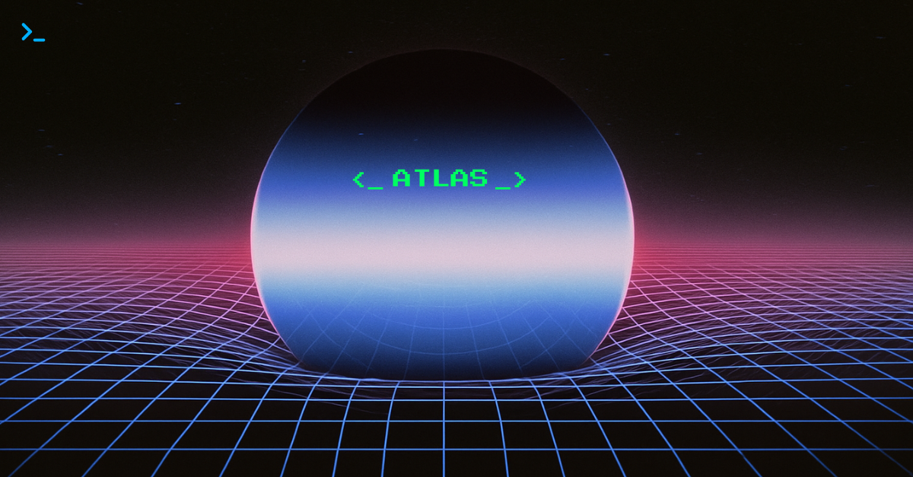
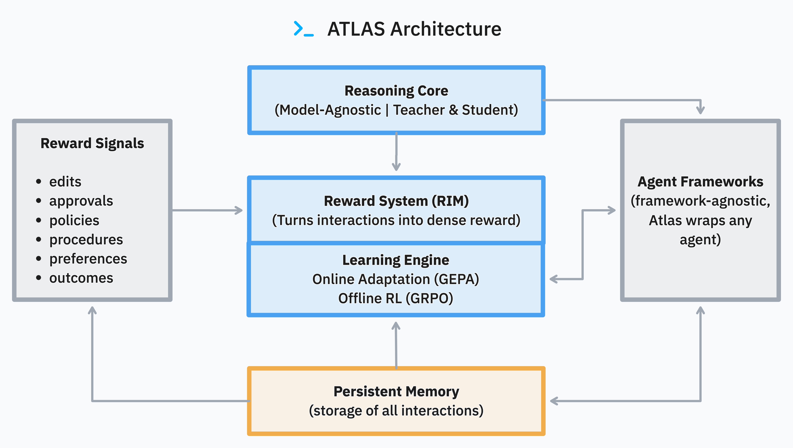

# ATLAS: A Continual Learning Architecture for Production AI

<div align="center">


<br>
[](https://huggingface.co/Arc-Intelligence/ATLAS-8B-Thinking)
[](https://huggingface.co/Arc-Intelligence/ATLAS-8B-Instruct)
[](https://huggingface.co/datasets/Arc-Intelligence/Arc-ATLAS-Teach-v0)

</div>

ATLAS is an architecture for production teams that need AI agents to improve from user interactions and feedback *after* deployment. It wraps any existing agent framework with the components required to create a closed-loop, continual learning system:

1.  **Reasoning Core**: A Teacher-Student model pair that enhances agent capabilities.
2.  **Reward System (RIM)**: Turns implicit and explicit user feedback (edits, approvals, tool usage) into a dense reward signal.
3.  **Learning Engine**: Uses online (GEPA) and offline (GRPO) methods to update models based on rewards.
4.  **Persistent Memory**: Stores all interactions for analysis and retraining.

Together, they form the complete learning loop shown below.

Teams have deployed this loop in dual-control environments and high-stakes operations, pairing ATLAS with human supervisors to ship reliable agents in production ([Introducing ATLAS](https://www.arc.computer/blog/introducing-atlas), [Navigating Dual-Control Environments](https://www.arc.computer/blog/navigating-dual-control-environments)). The system captures interaction data, scores it for quality, adapts the models, and redeploys the improved version.

<div align="center">

<br>
<em>Figure: ATLAS keeps the agent in a learn–evaluate–update cycle.</em>
</div>

📄 **[Read the ATLAS Technical Report](https://docs.arc.computer/technical-report)** for comprehensive methodology and performance analysis.

📚 **[Full Documentation](https://docs.arc.computer)** for complete guides, API reference, and examples.


---

## Quickstart — Evaluate, Then Optimize

Start by measuring how much a GPT-5 teacher and the ATLAS reward system improve one of your agents. Once you see the delta, graduate to the full GEPA optimization loop.

### Part A · 5 minutes — Score Baseline vs Teaching
1. Install dependencies (Python 3.11+):
   ```bash
   pip install -r requirements-py312.txt
   ```
2. Set credentials (OpenAI for models, Gemini for the reward judge):
   ```bash
   export OPENAI_API_KEY=sk-...
   export GEMINI_API_KEY=your_gemini_key
   ```
3. Run the quick evaluator. It captures a baseline response, asks a GPT-5 teacher for guidance, has the student retry with the teaching, and scores both with `RIMReward`.
   ```bash
   python examples/quickstart/evaluate.py \
     --question "Masha braided her dolls' hair..." \
     --teacher-model gpt-5 \
     --student-model gpt-4o-mini
   ```
   Example output:
   ```text
   ========================================================================
   Baseline student answer:
   ...
   Reward (baseline): 0.342
   Reward (with teaching): 0.781
   Delta: +0.439
   ========================================================================
   ```
   Change `--student-model` if you want to evaluate a different agent (any OpenAI Responses-compatible model).

### Part B · ~2 hours (optional) — Run GEPA Prompt Optimization
Reuse the proven compatibility config and let GEPA evolve the teaching prompts.

```bash
# Optionally pin the models the script will call
export TEACHER_MODEL=gpt-4.1
export STUDENT_MODEL=gpt-4o-mini

./scripts/openai_agent_atlas.sh configs/wrappers/openai_existing_agent.yaml
```
You can also start from `configs/examples/quickstart.yaml`, which reuses the same wrapper with minimal overrides.
OpenAI currently limits Assistants to GPT-4.x models, so the GEPA wrapper defaults to `gpt-4.1` (or you can set `TEACHER_MODEL` to `Arc-Intelligence/ATLAS-8B-Thinking`).
This loop iterates up to 40 evaluations (≈$10 in API spend) and writes the best prompts to `optimized_prompts.json`. Attach those prompts to your agent once you’re ready for deployment.
---

## How the Continual Loop Fits Together

Each quickstart mode taps into the same learning cycle:

1. **Evaluate (examples/quickstart/evaluate.py)** – capture baseline and teacher-guided traces, then use the RIM judges to quantify the lift. Nothing feeds back yet; this is your observation step.
2. **Optimize (GEPA configs)** – reuse those reward deltas as fitness so the prompt optimizer keeps proposing better teaching strategies. Teacher prompts change, student responses improve, rewards climb.
3. **Train (GRPO runs)** – when you need more than prompt tweaks, use the judged data to update the teacher weights themselves. New data → judges score it → teacher adapts → optimized prompts guide the student → repeat.

That evaluate → optimize → train arc is the “self-improvement at scale” loop: fresh interactions enter RIM, the reward signal decides what to keep or discard, and ATLAS updates the components that do the teaching so the deployed agent never goes stale.

---

## Repo Map
- `examples/quickstart/` – scripts and docs for the fast evaluation loop.
- `configs/` – datasets, wrapper configs, optimization recipes (see `configs/README.md`).
- `trainers/` – core ATLAS logic: GEPA engine, adapters, instrumentation.
- `custom_data/` – dataset loaders and utilities.
- `wrappers/` – integrations that wrap external agents/models.
- `docs/` – full documentation site sources.

---

## Implementation Paths

Each path maps to a component of the architecture, allowing you to adopt ATLAS incrementally.

### Path 1 — Adapt an Existing Agent in Hours

Use the **Learning Engine (GEPA)** and a pre-trained **Reasoning Core** to optimize your existing agent for a specific task. This is the most common starting point. See the [Online Optimization Guide](https://docs.arc.computer/training/online/optimize-with-atlas) for more.

- **Prerequisites**: An agent accessible via API, Python function, or OpenAI Assistant ID. API key for a reflection model (e.g., OpenAI, Gemini).
- **Command**:
  ```bash
  # Set API key for the reflection model
  export OPENAI_API_KEY="your-key-here"

  # This script wraps an existing agent and optimizes it
  ./scripts/openai_agent_atlas.sh configs/wrappers/openai_existing_agent.yaml
  ```
- **Expected Outcome**: A set of optimized teaching prompts in `optimized_prompts.json`. This process takes ~2 hours and costs ~$10 in API fees, delivering a performance improvement of up to +165% (measured as reward delta on evaluation tasks). See [Supercharging RL with Online Optimization](https://www.arc.computer/blog/supercharging-rl-with-online-optimization) for experimental setup.

### Path 2 — Deploy a Standalone Reward System

Use the **Reward System (RIM)** to evaluate agent performance with state-of-the-art accuracy. This is useful for benchmarking or generating high-quality data for fine-tuning. Learn more in the [Reward System Documentation](https://docs.arc.computer/concepts/reward-design).

- **Prerequisites**: Python environment and API access for judge models (e.g., Gemini).
- **Code**:
  ```python
  from RIM.reward_adapter import RIMReward

  # Initialize the reward system from its config file
  reward_system = RIMReward(config_path='configs/rim_config.yaml')

  # Evaluate any interaction
  evaluation = reward_system.evaluate(prompt="<user_prompt>", response="<agent_response>")
  print(f"Score: {evaluation.score}, Rationale: {evaluation.rationale}")
  print(f"Per-judge scores: {evaluation.judge_scores}")
  ```
- **Expected Outcome**: A lightweight result object exposing the aggregated score, rationale, and per-judge details. Advanced callers can inspect `evaluation.extra["info"]` for the raw judge payload. For batched or high-throughput evaluation, call the `RIMReward` instance directly with lists of prompts and completions. The quickstart script prints aggregated and per-judge scores by default; pass `--verbose-judges` to surface full judge traces. The system achieves 93.7% accuracy on RewardBench V2, outperforming all public models. Benchmarks and judge configuration are detailed in [ATLAS Reward System](https://www.arc.computer/blog/atlas-reward-system).

### Path 3 — Build a Custom Teacher Model

Use the full **Learning Engine (GRPO)** to train a new **Reasoning Core** from scratch on your own data. This is for advanced use cases requiring deep domain specialization. Follow the [Custom Teacher Training Guide](https://docs.arc.computer/first-experiment).

- **Prerequisites**: Multi-GPU environment (4-8x A100/H100 recommended).
- **Commands (Minimal Smoke Test)**:
  ```bash
  # Phase 1: SFT Warmup (1 epoch)
  scripts/launch.sh 1 configs/run/teacher_sft.yaml report_to=null save_final_model=false num_train_epochs=1

  # Phase 2: RL Training with vLLM (4 steps)
  scripts/launch_with_server.sh 1 1 configs/run/teacher_rcl.yaml report_to=null max_steps=4 eval_steps=1
  ```
- **Expected Outcome**: A custom-trained teacher model checkpoint. A full training run can achieve a +15.7% average accuracy lift on student agents.

---

## Core Distinctions

<details>
<summary><strong>Why not just fine-tune?</strong></summary>

Fine-tuning (or RLHF) creates a static, updated version of a model. It is compute-intensive and risks catastrophic forgetting. When the world changes, you must repeat the entire process.

ATLAS creates a **dynamic, continual learning loop**. The teacher-student architecture separates foundational knowledge from task-specific adaptation. This means:
- **No Catastrophic Forgetting**: The student model's weights are never changed, preserving its original capabilities.
- **Rapid Adaptation**: The online learning loop adapts to new tasks in hours, not weeks.
- **Compounding Knowledge**: Skills learned from one task can be reapplied to others, creating a library of reusable "skill capsules."

</details>

<details>
<summary><strong>Production Notes</strong></summary>

- **Observability**: The system is designed for production monitoring. Log reward scores, KL divergence, and non-degradation rates to track performance. Integrate with Prometheus or Datadog.
- **Failure Modes**: The most common failure mode is a reward collapse during RL training. This is mitigated by tuning the `beta` (KL divergence) parameter in `teacher_grpo.yaml` to prevent the policy from deviating too far from its reference.
- **Hardware**: Offline training runs on 8xA100 (40GB) or equivalent. Online optimization is API-driven and requires no specialized hardware. Inference can run on a single 16GB GPU.

</details>

---

## Installation

Conda is recommended for environment management. The repository has been validated with Python 3.11 and 3.12.

**Python 3.11:**
```sh
bash scripts/install_py311.sh
```

**Python 3.12:**
```sh
bash scripts/install_py312.sh
```
For detailed setup, see the [Installation Guide](https://docs.arc.computer/installation).

---

## Citation

If you use ATLAS in your research, please cite:
```bibtex
@article{atlas2025,
  title     = {ATLAS: A Hybrid RL Architecture for Compounding Intelligence},
  author    = {Arc Intelligence},
  journal   = {arXiv preprint},
  year      = {2025}
}
```
