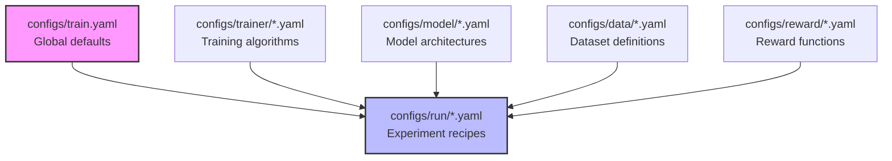

## Philosophy: Why Hydra?

ATLAS uses Hydra for configuration management to provide:

- **Composability**: Mix and match components without code changes
- **Reproducibility**: Every experiment is fully defined by configs
- **Command-line flexibility**: Override any parameter at runtime
- **Type safety**: Structured configs with validation

## The Configuration Hierarchy

Understanding how configurations compose is essential for customization:



### Layer Breakdown

Each configuration layer serves a specific purpose:

| Layer | Purpose | Example Files | When to Modify |
|-------|---------|---------------|----------------|
| `train.yaml` | Global defaults | Single file | Rarely - only for system-wide changes |
| `run/*.yaml` | Experiment recipes | `teacher_rcl.yaml`, `teacher_sft.yaml` | For new experiment types |
| `model/*.yaml` | Model specifications | `qwen3_8b.yaml`, `llama3_8b.yaml` | Adding new architectures |
| `data/*.yaml` | Dataset configs | `arc_atlas_rl.yaml`, `arc_atlas_sft.yaml` | New datasets or tasks |
| `trainer/*.yaml` | Algorithm settings | `teacher_grpo.yaml`, `sft.yaml` | Algorithm modifications |

## Walkthrough: Composing teacher_rcl.yaml

Let's dissect a complete experiment configuration to understand composition:

<AccordionGroup>
  <Accordion title="Base Configuration Structure">
    ```yaml
    # configs/run/teacher_rcl.yaml
    defaults:
      - _self_
      - override /trainer: teacher_grpo  # Algorithm choice
      - override /model: qwen3_8b        # Model architecture
      - override /data: arc_atlas_rl     # Dataset selection
      - override /reward: adaptive_teaching  # Reward function
    ```

    Each `override` line pulls in a complete configuration module:
    - `_self_`: Current file's settings take precedence
    - Order matters: Later overrides win conflicts
  </Accordion>

  <Accordion title="trainer: teacher_grpo">
    This specifies the GRPO algorithm for teacher training:

    ```yaml
    # configs/trainer/teacher_grpo.yaml
    beta: 0.04                    # KL divergence penalty
    temperature: 0.7               # Sampling temperature
    grpo_alpha: 0.5               # Reward clipping
    generation_aggregation_steps: 1
    ```

    **Key parameters**:
    - `beta`: Controls exploration vs exploitation (lower = more exploration)
    - `temperature`: Output diversity (higher = more creative)
    - See [Trainers API Reference](/api-reference/trainers) for full details
  </Accordion>

  <Accordion title="model: qwen3_8b">
    Defines the model architecture and loading:

    ```yaml
    # configs/model/qwen3_8b.yaml
    model_name_or_path: Qwen/Qwen2.5-7B-Instruct
    torch_dtype: bfloat16
    attn_implementation: flash_attention_2
    model_kwargs:
      trust_remote_code: true
    ```

    **Customization points**:
    - Change `model_name_or_path` for different checkpoints
    - Adjust `torch_dtype` for memory/precision tradeoffs
    - Enable quantization with `load_in_4bit: true`
  </Accordion>

  <Accordion title="data: arc_atlas_rl">
    Configures the training dataset:

    ```yaml
    # configs/data/arc_atlas_rl.yaml
    dataset_name: Arc-Intelligence/Arc-ATLAS
    dataset_config: rl
    max_train_samples: 100000
    preprocessing:
      max_length: 2048
      pad_to_multiple_of: 16
    ```

    **Important settings**:
    - `dataset_config`: Selects RL vs SFT data format
    - `max_train_samples`: Controls training set size
    - `max_length`: Maximum sequence length (memory impact)
  </Accordion>

  <Accordion title="reward: adaptive_teaching">
    Defines the reward function for RL:

    ```yaml
    # configs/reward/adaptive_teaching.yaml
    degradation_penalty_multiplier: 2.0
    efficiency_weight: 1.0
    baseline_threshold: 0.5
    max_probe_tokens: 500
    ```

    **Tuning guide**:
    - `efficiency_weight`: Higher values favor concise teaching
    - `baseline_threshold`: Minimum performance for rewards
    - See [Reward Design](/concepts/reward-design) for theory
  </Accordion>
</AccordionGroup>

## Customization Patterns

### Pattern 1: Command-Line Overrides

Override any parameter without changing files:

```bash
# Change learning rate
scripts/launch.sh 8 configs/run/teacher_sft.yaml learning_rate=1e-5

# Use different model
scripts/launch.sh 8 configs/run/teacher_sft.yaml model=llama3_8b

# Adjust batch size for memory
scripts/launch.sh 8 configs/run/teacher_sft.yaml \
  per_device_train_batch_size=2 \
  gradient_accumulation_steps=8
```

### Pattern 2: Creating New Configurations

<Steps>
  <Step title="Choose the Right Layer">
    Determine which configuration type to create:
    - New model? → `configs/model/`
    - New dataset? → `configs/data/`
    - New experiment? → `configs/run/`
  </Step>

  <Step title="Copy a Similar Config">
    Start from an existing configuration:
    ```bash
    cp configs/model/qwen3_8b.yaml configs/model/my_model.yaml
    ```
  </Step>

  <Step title="Modify Key Parameters">
    Edit your new configuration:
    ```yaml
    # configs/model/my_model.yaml
    model_name_or_path: meta-llama/Llama-3.2-8B-Instruct
    torch_dtype: float16  # Changed from bfloat16
    load_in_4bit: true    # Added quantization
    ```
  </Step>

  <Step title="Reference in Run Config">
    Use your new configuration:
    ```yaml
    # configs/run/my_experiment.yaml
    defaults:
      - override /model: my_model  # Your custom model
    ```
  </Step>
</Steps>

### Pattern 3: Multi-GPU Scaling

Adjust configurations for different hardware:

<Tabs>
  <Tab title="Single GPU">
    ```bash
    scripts/launch.sh 1 configs/run/teacher_sft.yaml \
      per_device_train_batch_size=1 \
      gradient_accumulation_steps=32 \
      offload=true
    ```
  </Tab>

  <Tab title="4 GPUs">
    ```bash
    scripts/launch.sh 4 configs/run/teacher_sft.yaml \
      per_device_train_batch_size=4 \
      gradient_accumulation_steps=4
    ```
  </Tab>

  <Tab title="8 GPUs">
    ```bash
    scripts/launch.sh 8 configs/run/teacher_sft.yaml \
      per_device_train_batch_size=8 \
      gradient_accumulation_steps=2
    ```
  </Tab>
</Tabs>

## Common Configuration Scenarios

### Scenario 1: Memory Optimization

<Warning>
Default configurations assume 40GB+ VRAM per GPU. Adjust for smaller GPUs:
</Warning>

```yaml
# For 24GB GPUs (e.g., RTX 3090)
per_device_train_batch_size: 1
gradient_accumulation_steps: 16
gradient_checkpointing: true
offload: true
torch_dtype: float16  # Instead of bfloat16
```

### Scenario 2: Faster Experimentation

Trade accuracy for speed during development:

```yaml
max_train_samples: 1000  # Smaller dataset
num_train_epochs: 1      # Fewer epochs
save_steps: 100          # More frequent checkpoints
eval_steps: 100          # More frequent evaluation
logging_steps: 10        # Verbose logging
```

### Scenario 3: Production Training

Maximize performance for deployment:

```yaml
num_train_epochs: 3
learning_rate: 5e-6
warmup_ratio: 0.1
weight_decay: 0.01
eval_strategy: "steps"
eval_steps: 500
save_total_limit: 3
load_best_model_at_end: true
metric_for_best_model: "eval_reward"
```

## Debugging Configuration Issues

### Viewing Composed Configuration

See the final merged configuration:

```bash
# Dry run to see composed config
python -m hydra.main \
  config_path=configs \
  config_name=train \
  +run=teacher_sft \
  --cfg job
```

### Common Errors and Solutions

<AccordionGroup>
  <Accordion title="Override not found">
    **Error**: `Could not override '/model'`

    **Solution**: Check that the config file exists:
    ```bash
    ls configs/model/
    ```
    Ensure exact filename match (without .yaml extension)
  </Accordion>

  <Accordion title="Type mismatch">
    **Error**: `ValidationError: expected type 'float'`

    **Solution**: Check parameter types in configs:
    ```yaml
    learning_rate: 1e-5  # Correct: scientific notation
    # learning_rate: "1e-5"  # Wrong: string
    ```
  </Accordion>

  <Accordion title="Memory overflow">
    **Error**: `CUDA out of memory`

    **Solution**: Reduce batch size or enable offloading:
    ```bash
    scripts/launch.sh 4 configs/run/teacher_sft.yaml \
      per_device_train_batch_size=1 \
      gradient_checkpointing=true \
      offload=true
    ```
  </Accordion>
</AccordionGroup>

## Best Practices

1. **Version Control Configs**: Commit configuration files with experiments for reproducibility

2. **Use Meaningful Names**: Name configs descriptively: `llama3_8b_quantized.yaml` not `model2.yaml`

3. **Document Custom Configs**: Add comments explaining non-obvious parameter choices

4. **Test Incrementally**: Verify each configuration layer works before composing

5. **Leverage Defaults**: Only override what you need to change

## Next Steps

<CardGroup cols={2}>
  <Card title="RL Training Guide" icon="robot" href="/training/offline/grpo-training">
    Apply configurations to train models
  </Card>
  <Card title="API Reference" icon="code" href="/api-reference/configs">
    Complete configuration parameter list
  </Card>
  <Card title="Distributed Training" icon="server" href="/training/offline/distributed-training">
    Scale configurations across nodes
  </Card>
  <Card title="Custom Experiments" icon="flask" href="/examples/custom-implementation">
    Build your own configurations
  </Card>
</CardGroup>