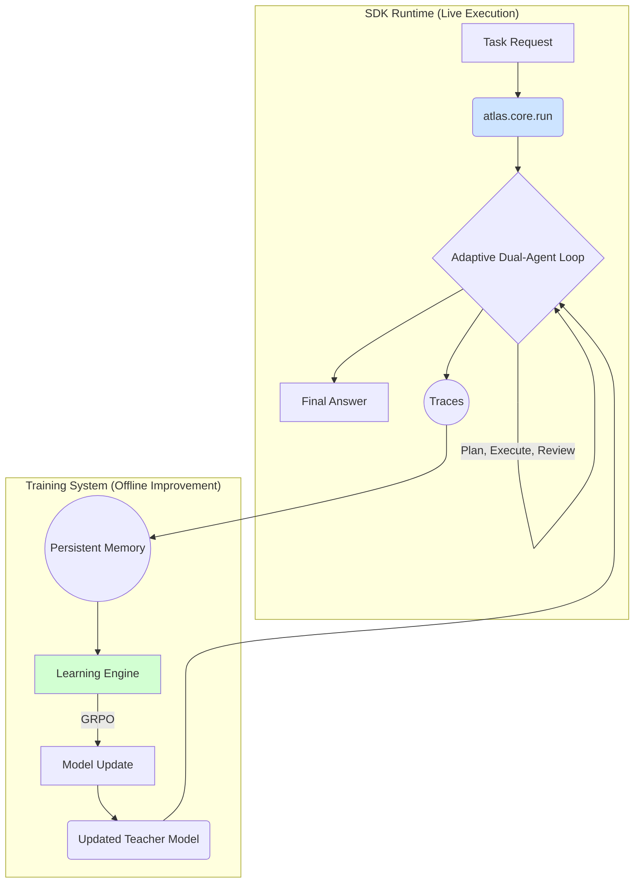

## System at a Glance

ATLAS is an architecture for production teams that need AI agents to improve from user interactions and feedback after deployment. It wraps any existing agent framework with the components needed to create a closed-loop, continual learning system.

The core components are:
1.  **[Reasoning Core](/concepts/adaptive-dual-agent-reasoning)**: Adaptive dual-agent reasoning—your agent paired with a verifying teacher that enhances outcomes.
2.  **[Reward System](/concepts/reward-design)**: Turns implicit and explicit user feedback into a dense reward signal.
3.  **[Learning Engine](/concepts/hybrid-learning)**: Uses offline GRPO to update models based on rewards, while the atlas-sdk runtime handles continual learning in production.
4.  **Persistent Memory**: Stores all interactions for analysis and retraining. This layer is configurable to use local disk, a cloud bucket (e.g., S3), or a production database (e.g., Postgres) for storage.

These components form the complete learning loop shown below. The system captures interaction data, scores it for quality, adapts the models, and redeploys the improved version.

*Figure: ATLAS keeps the agent in a learn–evaluate–update cycle.*

## The Learning Loop

The architecture operates as a continuous cycle:

1.  **Capture & Persist**: All agent interactions and user feedback (reward signals like edits, approvals, tool usage) are captured by the agent framework and stored in Persistent Memory.
2.  **Score & Reward**: The Reward System processes these raw signals, converting them into structured, dense rewards that quantify performance.
3.  **Adapt & Learn**: The Learning Engine uses these rewards to update the Reasoning Core via GRPO. The atlas-sdk runtime delivers rapid, task-specific tuning between offline runs.
4.  **Redeploy**: The improved teacher model (or its updated policy) is redeployed to the Reasoning Core, enhancing the agent's performance on subsequent tasks.

This entire loop is designed to be automated and run in production, enabling agents to compound intelligence over time.

## SDK Runtime vs. Training Architecture

The Atlas SDK provides the entry point to this learning loop. It is responsible for the **live execution** of tasks, while the broader Atlas training system handles the **offline improvement** of the models. The two systems are complementary.

1.  The **SDK Runtime** orchestrates your agent through a task. This process generates a `Final Answer` for the user and, crucially, detailed `Traces` of the interaction.
2.  These **Traces are persisted** and become the dataset for the offline **Training System**.
3.  The **Learning Engine** uses these traces to fine-tune the Teacher model via GRPO (offline reinforcement learning). Online continual learning is managed by the atlas-sdk runtime.
4.  The **Updated Teacher Model** is then redeployed, making the live SDK Runtime more effective on subsequent tasks.

This architecture ensures that every task executed by the SDK becomes a learning opportunity that improves the entire system over time. For a detailed breakdown of the runtime loop, see [`How Orchestration Works`](/sdk/orchestration).
