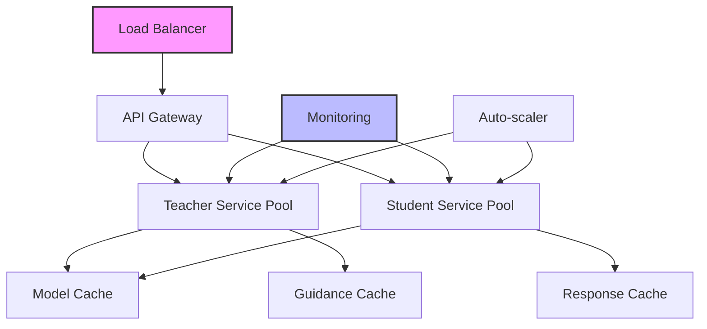

**TL;DR:** Pick the deployment pattern that matches your workload (microservices for always-on teacher/student pools, serverless for bursty workloads), confirm GPUs and observability are in place, then follow the implementation checklist to wire ATLAS into your production stack.

## Before You Begin

<Info>
Complete these setup steps so the production rollout focuses on infrastructure—not basics.
</Info>

- Finish the [Installation](/installation) guide and complete the [Quick Evaluation](/quickstart#quick-evaluation-5-minutes).
- Deploy the [inference-only integration](/integration/inference-only) to confirm your student model behaves with ATLAS guidance.
- Ensure you have GPU capacity (or an equivalent managed service) that matches the scale in the decision matrix below.
- Set up access to your monitoring stack (Prometheus, Datadog, etc.) so you can track non-degradation and latency from day one.

## Deployment Decision Matrix

| Pattern | When to choose | Infrastructure footprint | Related docs |
|---------|----------------|--------------------------|--------------|
| **Microservices** | Steady or high request volume, low-latency SLAs, dedicated GPU fleet | Long-running teacher + student services with caches and autoscaling | [See pattern](#microservices-architecture) • [Troubleshooting](/reference/troubleshooting) |
| **Serverless** | Bursty workloads, pay-per-use preference, managed GPU endpoints | Cloud functions + managed model hosts (SageMaker, Vertex AI) | [See pattern](#serverless-deployment) • [Inference Only](/integration/inference-only) |

## Architecture Overview

Production ATLAS deployment requires careful consideration of scale, reliability, and cost:



## Infrastructure Requirements

### Compute Resources

Recommended specifications for different scales:

| Deployment Size | Daily Requests | Teacher GPUs | Student GPUs | Memory | Cache Storage |
|----------------|---------------|--------------|--------------|---------|--------------|
| Small | &lt;10K | 1× A100 40GB | 2× A100 40GB | 128GB | 100GB SSD |
| Medium | 10K-100K | 2× A100 80GB | 4× A100 40GB | 256GB | 500GB SSD |
| Large | 100K-1M | 4× H100 80GB | 8× A100 80GB | 512GB | 2TB NVMe |
| Enterprise | &gt;1M | 8× H100 80GB | 16× H100 80GB | 1TB | 10TB NVMe |

### Network Requirements

- **Bandwidth**: 10Gbps minimum for model loading
- **Latency**: &lt;10ms between teacher and student services
- **Load balancing**: Layer 7 with sticky sessions

## Microservices Architecture

<Note>
Choose this when you need predictable latency, operate your own GPUs, or plan to run ATLAS continuously alongside other services.
</Note>

### Prerequisites

- Dedicated GPU nodes for the teacher and student pools (see [decision matrix](#deployment-decision-matrix))
- Centralized configuration/secrets management for API keys and model paths
- Observability pipeline (metrics + logs) ready to ingest the counters referenced in [Monitoring and Observability](#monitoring-and-observability)
- Familiarity with container orchestration (Kubernetes, ECS, etc.)

### Implementation Checklist

<Steps>
  <Step title="Deploy Teacher Service">
    Create a dedicated teacher service with model pooling:

    ```python
    # teacher_service.py
    from fastapi import FastAPI
    from transformers import AutoModelForCausalLM
    import asyncio
    from concurrent.futures import ThreadPoolExecutor

    class TeacherService:
        def __init__(self, num_replicas=2):
            self.app = FastAPI()
            self.executor = ThreadPoolExecutor(max_workers=num_replicas)
            self.models = self._load_models(num_replicas)
            self.setup_routes()

        def _load_models(self, num_replicas):
            """Load multiple model instances for parallel processing"""
            models = []
            for i in range(num_replicas):
                model = AutoModelForCausalLM.from_pretrained(
                    "Arc-Intelligence/ATLAS-8B-Thinking",
                    torch_dtype="auto",
                    device_map=f"cuda:{i}"
                )
                models.append(model)
            return models

        async def generate_guidance(self, prompt: str, model_idx: int = 0):
            """Generate teaching guidance asynchronously"""
            loop = asyncio.get_event_loop()
            return await loop.run_in_executor(
                self.executor,
                self._generate_sync,
                prompt,
                model_idx
            )

        def _generate_sync(self, prompt, model_idx):
            """Synchronous generation for thread pool"""
            model = self.models[model_idx % len(self.models)]
            # Generation logic here
            return guidance
    ```
  </Step>

  <Step title="Deploy Student Service">
    Create scalable student service with caching:

    ```python
    # student_service.py
    from fastapi import FastAPI
    import redis
    import hashlib
    import json

    class StudentService:
        def __init__(self):
            self.app = FastAPI()
            self.redis_client = redis.Redis(
                host='cache-server',
                port=6379,
                decode_responses=True
            )
            self.model = self._load_model()

        def _load_model(self):
            return AutoModelForCausalLM.from_pretrained(
                "meta-llama/Llama-3.2-8B-Instruct",
                torch_dtype="auto",
                device_map="auto"
            )

        async def generate_with_guidance(self, prompt: str, guidance: str):
            """Generate response with caching"""
            cache_key = self._get_cache_key(prompt, guidance)

            # Check cache
            cached = self.redis_client.get(cache_key)
            if cached:
                return json.loads(cached)

            # Generate response
            response = await self._generate(prompt, guidance)

            # Cache with expiry
            self.redis_client.setex(
                cache_key,
                3600,  # 1 hour TTL
                json.dumps(response)
            )
            return response

        def _get_cache_key(self, prompt, guidance):
            """Generate cache key from inputs"""
            content = f"{prompt}:{guidance}"
            return hashlib.md5(content.encode()).hexdigest()
    ```
  </Step>

  <Step title="Configure API Gateway">
    Set up routing and orchestration:

    ```yaml
    # kong.yaml or similar API gateway config
    services:
      - name: teacher-service
        url: http://teacher-service:8000
        routes:
          - paths:
              - /api/v1/guidance
        plugins:
          - name: rate-limiting
            config:
              minute: 100
          - name: request-size-limiting
            config:
              allowed_payload_size: 1

      - name: student-service
        url: http://student-service:8001
        routes:
          - paths:
              - /api/v1/generate
        plugins:
          - name: cache
            config:
              cache_ttl: 300
    ```
  </Step>

  <Step title="Deploy with Kubernetes">
    Create Kubernetes manifests for orchestration:

    ```yaml
    # atlas-deployment.yaml
    apiVersion: apps/v1
    kind: Deployment
    metadata:
      name: atlas-teacher
    spec:
      replicas: 2
      selector:
        matchLabels:
          app: atlas-teacher
      template:
        metadata:
          labels:
            app: atlas-teacher
        spec:
          containers:
          - name: teacher
            image: atlas/teacher:latest
            resources:
              requests:
                memory: "32Gi"
                nvidia.com/gpu: 1
              limits:
                memory: "64Gi"
                nvidia.com/gpu: 1
            env:
            - name: MODEL_NAME
              value: "Arc-Intelligence/ATLAS-8B-Thinking"
            - name: CUDA_VISIBLE_DEVICES
              value: "0"
    ---
    apiVersion: v1
    kind: Service
    metadata:
      name: atlas-teacher-service
    spec:
      selector:
        app: atlas-teacher
      ports:
      - protocol: TCP
        port: 8000
        targetPort: 8000
      type: LoadBalancer
    ```
  </Step>
</Steps>

## Serverless Deployment

<Note>
Choose this when traffic is spiky, you prefer managed scaling, or you are iterating before committing to a dedicated GPU cluster.
</Note>

### Prerequisites

- Cloud account with access to managed model hosting (e.g., SageMaker, Vertex AI)
- Network egress allowances for cross-service calls between teacher and student endpoints
- Plan for cold-start latency that aligns with your SLA

### Implementation Checklist

Deploy on serverless platforms for auto-scaling:

<Tabs>
  <Tab title="AWS Lambda + SageMaker">
    ```python
    # lambda_handler.py
    import boto3
    import json

    sagemaker_runtime = boto3.client('sagemaker-runtime')

    def lambda_handler(event, context):
        """Handle inference requests via SageMaker endpoints"""
        prompt = json.loads(event['body'])['prompt']

        # Call teacher endpoint
        teacher_response = sagemaker_runtime.invoke_endpoint(
            EndpointName='atlas-teacher-endpoint',
            ContentType='application/json',
            Body=json.dumps({'prompt': prompt})
        )
        guidance = json.loads(teacher_response['Body'].read())

        # Call student endpoint with guidance
        student_response = sagemaker_runtime.invoke_endpoint(
            EndpointName='atlas-student-endpoint',
            ContentType='application/json',
            Body=json.dumps({
                'prompt': prompt,
                'guidance': guidance['text']
            })
        )

        return {
            'statusCode': 200,
            'body': student_response['Body'].read()
        }
    ```
  </Tab>

  <Tab title="Google Cloud Run">
    ```python
    # cloud_run_service.py
    import os
    from flask import Flask, request, jsonify
    from google.cloud import aiplatform

    app = Flask(__name__)

    # Initialize Vertex AI
    aiplatform.init(
        project=os.environ['GCP_PROJECT'],
        location='us-central1'
    )

    @app.route('/enhance', methods=['POST'])
    def enhance():
        data = request.json
        prompt = data['prompt']

        # Use Vertex AI endpoints
        teacher_endpoint = aiplatform.Endpoint(
            endpoint_name='atlas-teacher'
        )
        student_endpoint = aiplatform.Endpoint(
            endpoint_name='atlas-student'
        )

        # Two-pass protocol
        guidance = teacher_endpoint.predict(
            instances=[{"prompt": prompt}]
        )
        response = student_endpoint.predict(
            instances=[{
                "prompt": prompt,
                "guidance": guidance.predictions[0]
            }]
        )

        return jsonify(response.predictions[0])

    if __name__ == '__main__':
        app.run(port=8080)
    ```
  </Tab>
</Tabs>

## Performance Optimization

### GPU Utilization

Maximize throughput with batching and pooling:

```python
class OptimizedInference:
    def __init__(self, model, max_batch_size=8):
        self.model = model
        self.max_batch_size = max_batch_size
        self.request_queue = asyncio.Queue()
        self.response_futures = {}

    async def batch_processor(self):
        """Process requests in batches for efficiency"""
        while True:
            batch = []
            futures = []

            # Collect requests up to batch size
            while len(batch) < self.max_batch_size:
                try:
                    request = await asyncio.wait_for(
                        self.request_queue.get(),
                        timeout=0.01  # 10ms wait
                    )
                    batch.append(request['prompt'])
                    futures.append(request['future'])
                except asyncio.TimeoutError:
                    break

            if batch:
                # Process batch
                outputs = self.model.generate(batch)

                # Return results
                for future, output in zip(futures, outputs):
                    future.set_result(output)

    async def generate(self, prompt):
        """Queue request for batch processing"""
        future = asyncio.Future()
        await self.request_queue.put({
            'prompt': prompt,
            'future': future
        })
        return await future
```

### Caching Strategies

Implement multi-level caching:

```python
class MultiLevelCache:
    def __init__(self):
        # L1: In-memory cache (fast, limited size)
        self.memory_cache = LRUCache(maxsize=1000)

        # L2: Redis cache (medium speed, larger)
        self.redis_cache = redis.Redis(
            host='localhost',
            port=6379
        )

        # L3: Disk cache (slow, unlimited)
        self.disk_cache = DiskCache('/var/cache/atlas')

    async def get(self, key):
        """Try caches in order of speed"""
        # L1: Memory
        value = self.memory_cache.get(key)
        if value:
            return value

        # L2: Redis
        value = self.redis_cache.get(key)
        if value:
            self.memory_cache[key] = value
            return value

        # L3: Disk
        value = self.disk_cache.get(key)
        if value:
            self.redis_cache.setex(key, 3600, value)
            self.memory_cache[key] = value
            return value

        return None

    async def set(self, key, value, ttl=3600):
        """Update all cache levels"""
        self.memory_cache[key] = value
        self.redis_cache.setex(key, ttl, value)
        self.disk_cache.set(key, value)
```

## Monitoring and Observability

### Key Metrics

Track these essential metrics:

```python
from prometheus_client import Counter, Histogram, Gauge
import time

# Define metrics
request_count = Counter(
    'atlas_requests_total',
    'Total requests processed',
    ['model', 'status']
)

request_duration = Histogram(
    'atlas_request_duration_seconds',
    'Request latency',
    ['model', 'operation']
)

model_memory = Gauge(
    'atlas_model_memory_bytes',
    'Model memory usage',
    ['model', 'device']
)

improvement_score = Histogram(
    'atlas_improvement_score',
    'Enhancement improvement scores',
    buckets=[0, 0.1, 0.2, 0.3, 0.4, 0.5, 0.6, 0.7, 0.8, 0.9, 1.0]
)

class MonitoredATLAS:
    def __init__(self, atlas_instance):
        self.atlas = atlas_instance

    async def enhance_with_metrics(self, prompt):
        """Enhanced inference with monitoring"""
        start_time = time.time()

        try:
            result = await self.atlas.run_full_protocol(prompt)

            # Record success metrics
            request_count.labels(
                model='atlas',
                status='success'
            ).inc()

            improvement_score.observe(result.improvement_score)

            return result

        except Exception as e:
            # Record failure
            request_count.labels(
                model='atlas',
                status='error'
            ).inc()
            raise

        finally:
            # Record duration
            duration = time.time() - start_time
            request_duration.labels(
                model='atlas',
                operation='enhance'
            ).observe(duration)
```

### Logging Configuration

Structured logging for debugging:

```python
import structlog
import json

# Configure structured logging
structlog.configure(
    processors=[
        structlog.stdlib.filter_by_level,
        structlog.stdlib.add_logger_name,
        structlog.stdlib.add_log_level,
        structlog.stdlib.PositionalArgumentsFormatter(),
        structlog.processors.TimeStamper(fmt="iso"),
        structlog.processors.StackInfoRenderer(),
        structlog.processors.format_exc_info,
        structlog.processors.UnicodeDecoder(),
        structlog.processors.JSONRenderer()
    ],
    context_class=dict,
    logger_factory=structlog.stdlib.LoggerFactory(),
    cache_logger_on_first_use=True,
)

logger = structlog.get_logger()

class LoggedInference:
    def __init__(self):
        self.logger = logger.bind(service="atlas")

    async def process_request(self, request_id, prompt):
        """Process with comprehensive logging"""
        log = self.logger.bind(request_id=request_id)

        log.info(
            "request_received",
            prompt_length=len(prompt),
            prompt_preview=prompt[:100]
        )

        try:
            # Diagnostic phase
            log.info("diagnostic_started")
            diagnosis = await self.diagnose(prompt)
            log.info(
                "diagnostic_complete",
                capability_score=diagnosis.score
            )

            # Guidance phase
            log.info("guidance_started")
            guidance = await self.generate_guidance(diagnosis)
            log.info(
                "guidance_complete",
                guidance_length=len(guidance)
            )

            # Enhancement phase
            log.info("enhancement_started")
            result = await self.enhance(prompt, guidance)
            log.info(
                "enhancement_complete",
                improvement=result.improvement_score,
                tokens_used=result.total_tokens
            )

            return result

        except Exception as e:
            log.error(
                "processing_failed",
                error=str(e),
                exc_info=True
            )
            raise
```

## Cost Optimization

### Dynamic Model Selection

Route requests to appropriate models based on complexity:

```python
class CostOptimizedRouter:
    def __init__(self):
        # Models ordered by cost/capability
        self.models = [
            {'name': 'small', 'cost': 0.001, 'threshold': 0.3},
            {'name': 'medium', 'cost': 0.005, 'threshold': 0.6},
            {'name': 'large', 'cost': 0.02, 'threshold': 0.9}
        ]

    def select_model(self, prompt, max_cost=0.01):
        """Select most cost-effective model"""
        complexity = self.assess_complexity(prompt)

        for model in self.models:
            if model['cost'] <= max_cost and complexity <= model['threshold']:
                return model['name']

        # Default to smallest model if budget exceeded
        return self.models[0]['name']

    def assess_complexity(self, prompt):
        """Estimate query complexity"""
        indicators = {
            'length': len(prompt) / 1000,
            'technical_terms': self.count_technical_terms(prompt) / 10,
            'nested_logic': self.detect_nested_logic(prompt)
        }
        return np.mean(list(indicators.values()))
```

### Spot Instance Management

Use spot instances for cost-effective scaling:

```python
class SpotInstanceManager:
    def __init__(self, aws_client):
        self.ec2 = aws_client
        self.active_instances = []

    async def provision_spot_instance(self, instance_type='g5.xlarge'):
        """Request spot instance for inference"""
        response = self.ec2.request_spot_instances(
            InstanceCount=1,
            Type='one-time',
            LaunchSpecification={
                'ImageId': 'ami-atlas-inference',
                'InstanceType': instance_type,
                'KeyName': 'atlas-key',
                'SecurityGroups': ['atlas-sg'],
                'UserData': self.get_startup_script()
            },
            SpotPrice=str(self.calculate_bid_price(instance_type))
        )

        instance_id = response['SpotInstanceRequests'][0]['InstanceId']
        self.active_instances.append(instance_id)
        return instance_id

    def calculate_bid_price(self, instance_type):
        """Calculate optimal bid price"""
        history = self.ec2.describe_spot_price_history(
            InstanceTypes=[instance_type],
            MaxResults=100
        )
        prices = [float(h['SpotPrice']) for h in history['SpotPriceHistory']]
        return np.percentile(prices, 75)  # 75th percentile bid
```

## Security Considerations

### API Authentication

Implement secure authentication:

```python
from fastapi import FastAPI, Depends, HTTPException
from fastapi.security import HTTPBearer, HTTPAuthorizationCredentials
import jwt

security = HTTPBearer()

class AuthHandler:
    def __init__(self, secret_key):
        self.secret = secret_key

    def decode_token(self, token):
        try:
            payload = jwt.decode(
                token,
                self.secret,
                algorithms=['HS256']
            )
            return payload
        except jwt.ExpiredSignatureError:
            raise HTTPException(401, 'Token expired')
        except jwt.InvalidTokenError:
            raise HTTPException(401, 'Invalid token')

auth_handler = AuthHandler(os.environ['JWT_SECRET'])

async def verify_token(
    credentials: HTTPAuthorizationCredentials = Depends(security)
):
    token = credentials.credentials
    return auth_handler.decode_token(token)

@app.post('/api/enhance', dependencies=[Depends(verify_token)])
async def enhance_endpoint(request: EnhanceRequest):
    # Authenticated request processing
    pass
```

### Input Validation

Sanitize and validate inputs:

```python
from pydantic import BaseModel, validator, Field
import re

class SafePrompt(BaseModel):
    text: str = Field(..., max_length=4096)
    temperature: float = Field(0.7, ge=0.0, le=2.0)
    max_tokens: int = Field(512, ge=1, le=2048)

    @validator('text')
    def sanitize_text(cls, v):
        # Remove potential injection attempts
        v = re.sub(r'[<>]', '', v)  # Remove HTML
        v = re.sub(r'[\x00-\x08\x0B\x0C\x0E-\x1F]', '', v)  # Control chars
        return v

    @validator('text')
    def check_content(cls, v):
        # Content filtering
        blocked_patterns = [
            r'(?i)api[_\s]?key',
            r'(?i)password',
            r'(?i)secret'
        ]
        for pattern in blocked_patterns:
            if re.search(pattern, v):
                raise ValueError('Potentially sensitive content detected')
        return v
```

## Disaster Recovery

### Backup Strategies

Implement comprehensive backup:

```bash
#!/bin/bash
# backup.sh

# Backup model weights
aws s3 sync /models s3://atlas-backups/models/$(date +%Y%m%d)/ \
    --exclude "*.pyc" \
    --exclude "__pycache__/*"

# Backup cache data
redis-cli BGSAVE
aws s3 cp /var/lib/redis/dump.rdb \
    s3://atlas-backups/cache/redis-$(date +%Y%m%d).rdb

# Backup configuration
kubectl get configmaps -o yaml > configs-$(date +%Y%m%d).yaml
aws s3 cp configs-*.yaml s3://atlas-backups/configs/

# Backup metrics
prometheus_backup --output s3://atlas-backups/metrics/
```

### Failover Procedures

Automated failover with health checks:

```python
class FailoverManager:
    def __init__(self, primary_url, backup_url):
        self.primary = primary_url
        self.backup = backup_url
        self.use_primary = True

    async def health_check(self, url):
        """Check service health"""
        try:
            response = await httpx.get(f"{url}/health", timeout=5.0)
            return response.status_code == 200
        except:
            return False

    async def get_service_url(self):
        """Get active service URL with failover"""
        if self.use_primary:
            if await self.health_check(self.primary):
                return self.primary
            else:
                logger.warning("Primary service down, failing over")
                self.use_primary = False
                return self.backup
        else:
            # Try to restore primary
            if await self.health_check(self.primary):
                logger.info("Primary service restored")
                self.use_primary = True
                return self.primary
            return self.backup
```

## Next Steps

<CardGroup cols="2">
  <Card title="Custom Training" icon="dumbbell" href="/training/offline/grpo-training">
    Train production-optimized models with GRPO
  </Card>
  <Card title="Monitoring Setup" icon="chart-line" href="/integration/production-deployment#monitoring-and-observability">
    Configure observability stack
  </Card>
  <Card title="Training Configs API" icon="code" href="/api-reference/training-configs">
    Complete configuration documentation
  </Card>
  <Card title="Evaluation Methodology" icon="gauge" href="/benchmarks/evaluation-methodology">
    Performance evaluation guide
  </Card>
</CardGroup>
