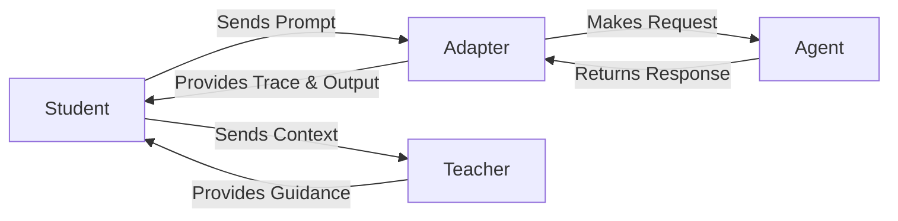

Atlas SDK follows a simple promise: **your agent, our orchestration**. Adapters create a small, consistent interface so you can place the adaptive dual-agent loop (student + verifying teacher) on top of nearly anything—from hosted APIs to local Python functions.

## Choosing an Adapter

| Adapter | Use when… | Strengths | Things to watch |
|---------|-----------|-----------|-----------------|
| `litellm` | You need multi-provider support or want future-proof compatibility. | Supports 100+ LLM providers, minimal setup, native tool calling, streaming support. | Recommended for all new projects. |
| `http_api` | Your agent already runs behind an HTTP endpoint. | Language-agnostic, deploy-anywhere. | You define the payload schema, handle auth, and parse responses. |
| `python` | You want to call local functions or LangChain runnables directly. | Lowest latency, easy debugging. | Runs inside the orchestrator process—ensure your code is safe and performant. |



## LiteLLM Adapter (`atlas/connectors/litellm.py`)

This is the recommended adapter for all LLM providers, supporting 100+ models via LiteLLM.

<Warning>
The `type: openai` adapter is deprecated. Use `type: litellm` instead. The litellm adapter supports all OpenAI-compatible providers (OpenAI, Azure OpenAI) plus Anthropic Claude, Google Gemini, XAI Grok, AWS Bedrock, and local models via Ollama or vLLM. The openai type remains supported for backward compatibility but emits deprecation warnings.
</Warning>

```yaml
agent:
  type: litellm
  name: sdk-quickstart-litellm
  system_prompt: |
    You are the Atlas Student. Be concise and helpful.
  tools: []
  llm:
    provider: openai
    model: gpt-4o-mini
    api_key_env: OPENAI_API_KEY
    temperature: 0.0
    max_output_tokens: 768
```

- Supports conversation history and tool call metadata automatically.
- Accepts `response_format` for JSON mode.
- Works with OpenAI, Anthropic Claude, Google Gemini, XAI Grok, Azure OpenAI, AWS Bedrock, and local models (Ollama, vLLM).

## HTTP Adapter (`atlas/connectors/http.py`)

Best for microservices, serverless functions, or non-Python agents.

```yaml
agent:
  type: http_api
  name: example-http-agent
  transport:
    base_url: https://agent.example.com/run
    headers:
      Authorization: Bearer $AGENT_TOKEN
    timeout_seconds: 60
    retry:
      attempts: 3
      backoff_seconds: 1.0
  payload_template:
    mode: inference
  result_path:
    - data
    - output
```

Wrap any service that accepts a JSON request. You define:

- **`payload_template`**: The base JSON payload; the adapter injects the `prompt` and optional metadata.
- **`result_path`**: A list of keys to traverse in the JSON response to find the agent's output string.
- **Auth & retries**: Handled via the `transport` block, which mirrors `httpx` settings.

## Python Adapter (`atlas/connectors/python.py`)

Ideal when your agent is a local Python function or a LangChain runnable.

```yaml
agent:
  type: python
  name: example-python-agent
  import_path: agents.python_example
  attribute: run_agent
  working_directory: ./
  allow_generator: false
```

- The adapter imports the `attribute` (e.g., `run_agent`) from the `import_path` module.
- If the callable is async, the adapter awaits it; sync functions run in a background thread.
- Set `allow_generator: true` to let the adapter consume a generator, concatenating all yielded strings into a single output.

## Building Custom Adapters

All adapters share a minimal interface (`AgentAdapter`). To add a new one (e.g., for gRPC), follow these steps:

1. Extend the `AdapterType` enum in `atlas/config/models.py`.
2. Implement a class inheriting from `AgentAdapter`.
3. Register it with `register_adapter` (see `atlas.connectors.registry`) and import the module from `atlas.connectors.__init__` so it auto-registers at runtime.

```python
from atlas.connectors.registry import AgentAdapter, register_adapter
from atlas.config.models import AdapterType

class GRPCAdapter(AgentAdapter):
    async def ainvoke(self, prompt: str, metadata: dict | None = None) -> str:
        # 1. Connect to your gRPC service.
        # 2. Build the request from the prompt.
        # 3. Execute the call and get a response.
        # 4. Return the response as a string.
        return f"Response for prompt: {prompt}"

# Assumes you've added GRPC to the AdapterType enum
register_adapter(AdapterType.GRPC, GRPCAdapter)
```

Most teams start by copying the `http_api` adapter and swapping the transport layer.

<Note>
Atlas auto-imports built-in adapters via `atlas.connectors.__init__`. Custom adapters should follow the same pattern—expose your module there (or import it in your app startup) so registration runs once on load.
</Note>

## Migrating from OpenAI to LiteLLM Adapter

If you have existing configs using `type: openai`, migration is straightforward:

### Before (Deprecated)
```yaml
agent:
  type: openai
  name: my-agent
  system_prompt: "You are helpful."
  llm:
    provider: openai
    model: gpt-4o-mini
    api_key_env: OPENAI_API_KEY
```

### After (Recommended)
```yaml
agent:
  type: litellm  # Changed from openai
  name: my-agent
  system_prompt: "You are helpful."
  llm:
    provider: openai  # Provider stays the same
    model: gpt-4o-mini
    api_key_env: OPENAI_API_KEY
```

### Breaking Changes
**None.** The litellm adapter is a drop-in replacement. All OpenAI-compatible configs work without modification beyond changing the `type` field.

### Benefits of Migration
1. **Future-proof**: Access to new providers without code changes
2. **Local models**: Use Ollama or vLLM with the same config structure
3. **Cost optimization**: Easily switch to faster/cheaper models
4. **No warnings**: Eliminate deprecation warnings in logs

### Testing Migration
```bash
# 1. Update your config
sed -i '' 's/type: openai/type: litellm/' config.yaml

# 2. Run a test task
atlas run --config config.yaml --task "Test migration"

# 3. Verify no warnings in output
```

## Decision Checklist

| Need | Recommendation |
|------|----------------|
| Fastest time-to-first-run | `litellm` adapter with any provider. |
| Reuse an existing microservice | `http_api` adapter with proper retries and auth. |
| Full control in local experiments | `python` adapter calling your local function. |
| Access any LLM provider (OpenAI, Claude, Gemini, etc.) | Use `litellm` adapter with the appropriate provider setting. |

## Next Steps

- Configure the rest of the runtime in [`SDK Configuration`](/sdk/configuration).
- See how the orchestrator uses your adapter in [`How Orchestration Works`](/sdk/orchestration).
- Understand the dual-agent reasoning concept in [`Adaptive Dual-Agent Reasoning`](/concepts/adaptive-dual-agent-reasoning).
