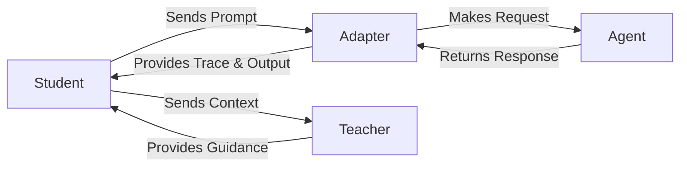

Atlas SDK follows a simple promise: **your agent, our orchestration**. Adapters create a small, consistent interface so you can place the adaptive dual-agent loop (student + verifying teacher) on top of nearly anything—from hosted APIs to local Python functions.

## Choosing an Adapter

| Adapter | Use when… | Strengths | Things to watch |
|---------|-----------|-----------|-----------------|
| `litellm` | You need multi-provider support or want future-proof compatibility. | Supports 100+ LLM providers, minimal setup, native tool calling, streaming support. | Recommended for all new projects. |
| `http_api` | Your agent already runs behind an HTTP endpoint. | Language-agnostic, deploy-anywhere. | You define the payload schema, handle auth, and parse responses. |
| `python` | You want to call local functions or LangChain runnables directly. | Lowest latency, easy debugging. | Runs inside the orchestrator process—ensure your code is safe and performant. |


```mermaid
graph LR
    Student -->|Sends Prompt| Adapter
    Adapter -->|Makes Request| Agent
    Agent -->|Returns Response| Adapter
    Adapter -->|Provides Trace & Output| Student
    Student -->|Sends Context| Teacher
    Teacher -->|Provides Guidance| Student
```

## LiteLLM Adapter (`atlas/connectors/litellm.py`)

This is the recommended adapter for all LLM providers, supporting 100+ models via LiteLLM.

<Warning>
The `type: openai` adapter is deprecated. Use `type: litellm` instead. The litellm adapter supports all OpenAI-compatible providers (OpenAI, Azure OpenAI) plus Anthropic Claude, Google Gemini, XAI Grok, AWS Bedrock, and local models via Ollama or vLLM. The openai type remains supported for backward compatibility but emits deprecation warnings.
</Warning>

```yaml
agent:
  type: litellm
  name: sdk-quickstart-litellm
  system_prompt: |
    You are the Atlas Student. Be concise and helpful.
  tools: []
  llm:
    provider: openai
    model: gpt-4o-mini
    api_key_env: OPENAI_API_KEY
    temperature: 0.0
    max_output_tokens: 768
```

- Supports conversation history and tool call metadata automatically.
- Accepts `response_format` for JSON mode.
- Works with OpenAI, Anthropic Claude, Google Gemini, XAI Grok, Azure OpenAI, AWS Bedrock, and local models (Ollama, vLLM).

## HTTP Adapter

For microservices or non-Python agents. Set `type: http_api`, provide `transport.base_url`, and define `payload_template` + `result_path`. See [Configuration Reference](/sdk/configuration#agent-block-agent) for details.

## Python Adapter

For local functions or LangGraph runnables. Set `type: python`, specify `import_path` and `attribute`. Supports async/sync callables and generators. See [Configuration Reference](/sdk/configuration#agent-block-agent) for details.

## Building Custom Adapters

All adapters share a minimal interface (`AgentAdapter`). To add a new one (e.g., for gRPC), follow these steps:

1. Extend the `AdapterType` enum in `atlas/config/models.py`.
2. Implement a class inheriting from `AgentAdapter`.
3. Register it with `register_adapter` (see `atlas.connectors.registry`) and import the module from `atlas.connectors.__init__` so it auto-registers at runtime.

```python
from atlas.connectors.registry import AgentAdapter, register_adapter
from atlas.config.models import AdapterType

class GRPCAdapter(AgentAdapter):
    async def ainvoke(self, prompt: str, metadata: dict | None = None) -> str:
        # 1. Connect to your gRPC service.
        # 2. Build the request from the prompt.
        # 3. Execute the call and get a response.
        # 4. Return the response as a string.
        return f"Response for prompt: {prompt}"

# Assumes you've added GRPC to the AdapterType enum
register_adapter(AdapterType.GRPC, GRPCAdapter)
```

Most teams start by copying the `http_api` adapter and swapping the transport layer.

<Note>
Atlas auto-imports built-in adapters via `atlas.connectors.__init__`. Custom adapters should follow the same pattern—expose your module there (or import it in your app startup) so registration runs once on load.
</Note>

## Structured Payloads

Pass complex nested dictionaries as tasks without serialization overhead:

```python
task = {
    "query": "Debug API errors",
    "context": {"service": "payments", "error_rate": 0.15}
}
result = adapter.execute(task=task)
```

Works with LangGraph, custom agents, and any adapter. No manual JSON encoding required.

## Learning Tracking

Integrate learning tracking into custom adapters:

```python
from atlas.learning.usage import get_tracker

tracker = get_tracker()
playbook = tracker.resolve_playbook(learning_key="my-agent")
tracker.detect_and_record(user_input=task, playbook_entries=playbook)
tracker.record_action_adoption(entry_id=entry.id, adopted=True)
tracker.record_session_outcome(session_id=sid, success=True)
```

Four core methods: `resolve_playbook()`, `detect_and_record()`, `record_action_adoption()`, `record_session_outcome()`. See [Learning System](/sdk/learning-system) for details.

## Migrating from OpenAI to LiteLLM Adapter

Change `type: openai` to `type: litellm` in your config. The litellm adapter is a drop-in replacement with no breaking changes. Benefits include multi-provider support, local model compatibility, and elimination of deprecation warnings.

## Decision Checklist

| Need | Recommendation |
|------|----------------|
| Fastest time-to-first-run | `litellm` adapter with any provider. |
| Reuse an existing microservice | `http_api` adapter with proper retries and auth. |
| Full control in local experiments | `python` adapter calling your local function. |
| Access any LLM provider (OpenAI, Claude, Gemini, etc.) | Use `litellm` adapter with the appropriate provider setting. |

## Next Steps

- Configure the rest of the runtime in [`SDK Configuration`](/sdk/configuration).
- See how the orchestrator uses your adapter in [`How Orchestration Works`](/sdk/orchestration).
- Understand the dual-agent reasoning concept in [`Adaptive Dual-Agent Reasoning`](/concepts/adaptive-dual-agent-reasoning).
