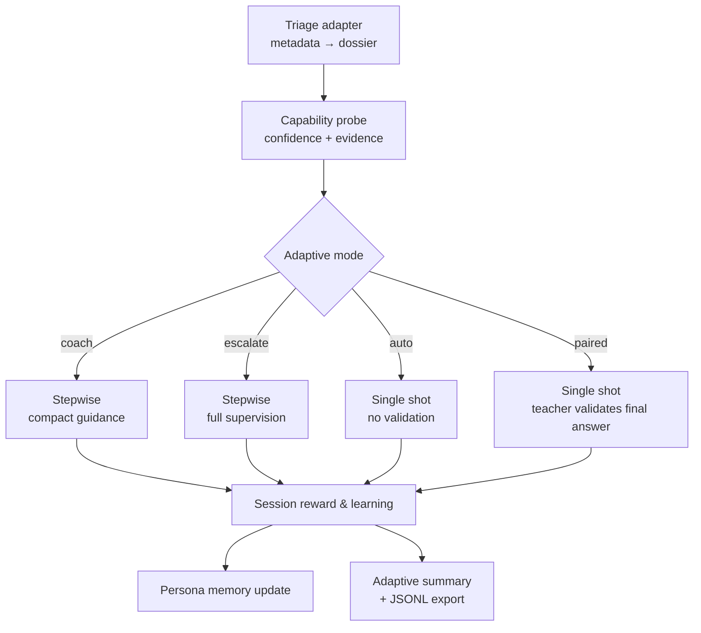

The Atlas SDK orchestrator starts every run with triage, gathers adaptive signals, and then chooses how tightly to supervise the Student. Understanding that flow makes it easier to tune configs and interpret telemetry.

## Adaptive Flow Overview



1. **Triage dossier** – Every run invokes a triage adapter (default: `atlas.utils.triage.default_build_dossier`) that normalises session metadata into risks, signals, and persona hints.  
2. **Capability probe** – The probe LLM inspects the dossier plus recent history, returning `{mode, confidence, evidence}`. If `certify_first_run` is enabled and the fingerprint is unseen, the runtime forces a one-time certification (`paired`) before probing.
3. **Adaptive mode** – The orchestrator records the decision, stores probe evidence, and chooses between four lanes:
   - `auto` – single-shot execution without validation to keep latency low.
   - `paired` – single-shot execution with a single validation pass (ideal for certifications).
   - `coach` – converts the reviewed plan into a single step but always validates and allows a retry.
   - `escalate` – keeps the full stepwise plan with guidance, retries, and granular telemetry.
4. **Execution loop** – Depending on the lane, the Student either executes a single combined step or walks through the reviewed plan. Teacher interventions (validation, guidance, retries) are lane-aware.
5. **Reward & learning** – The Reward System aggregates judges, emits `session_reward`, and captures learning notes. Certification verdicts are reused as the reward signal when possible.
6. **Memory & telemetry** – Persona memories are refreshed, adaptive summaries are stored, and exporters/streamers consume the structured metadata. See the [Adaptive Runtime Guide](../runtime_adaptive_flow.md) for a deeper dive.

## Lane Cheatsheet

| Lane | When it triggers | Supervision profile | Persistence highlights |
|------|------------------|---------------------|------------------------|
| `auto` | High confidence history | Student executes once, no validation | Telemetry records lane + confidence, reward may be skipped |
| `paired` | Certification required or medium confidence | Student executes once, Teacher validates final answer | Certification flag stored, reward reused from validation |
| `coach` | Probe confidence between the `coach` and `paired` thresholds | Plan collapses to single step with validation + optional retry | Guidance compact, adaptive summary logs probe evidence |
| `escalate` | Low confidence or manual override | Full plan review, per-step validation, retries allowed | Captures detailed step metadata, guidance, and persona updates |

Tune thresholds and fallback behaviour under `adaptive_teaching.probe` in your config (see [`SDK Configuration`](/sdk/configuration#adaptive_teaching)).

## Retries, Guidance, and Certification

- Step retries are only attempted in lanes that permit them (`coach` and `escalate` by default) and are capped by `orchestration.max_retries`.  
- The Teacher’s guidance is appended to the execution context and streamed to the console so you can see why a retry happened.  
- Certification runs (`paired` on a new fingerprint) mark the session as `certification_run` inside `adaptive_summary` and store the verdict for future routing.

## Event Stream & Telemetry

Every significant action is published to the `ExecutionContext` event stream. Subscribe to it to power CLI streams, dashboards, or custom logging:

```python
from atlas.runtime.orchestration.execution_context import ExecutionContext

context = ExecutionContext.get()
subscription = context.event_stream.subscribe(print)
```

Key metadata to expect:

- `adaptive_summary` – active mode, probe payload, confidence, and recent history (surfaces in the console streamer and JSONL exports).
- `steps` – per-step attempts, timings, retry status, and guidance messages.
- `session_reward` / `reward_summary` – aggregated reward score plus individual judge breakdowns.
- `triage_dossier`, `personas_used`, `persona_updates` – the context and outcomes that feed persona learning.

Attach a custom `TelemetryPublisher` if you need to forward events elsewhere; otherwise the default console streamer handles everything automatically.

## Anatomy of `atlas.core.run`

At a high level the public API (`atlas.core.run` / `atlas.core.arun`) performs the following:

1. Load and validate your config (`atlas/config/loader.py`) and reset the `ExecutionContext`.
2. Build the agent adapter (`create_from_atlas_config`) plus Student and Teacher prompts (`atlas.prompts.build_student_prompts` / `build_teacher_prompts`).
3. Instantiate Student, Teacher, and the session-level Reward `Evaluator`.
4. Load the triage adapter and capability probe client defined in `adaptive_teaching`, collecting fingerprint hints for persona memory.
5. Connect to optional storage (Postgres) and set up telemetry publishers or console streaming.
6. Run the `Orchestrator`, which performs triage, probes for a lane, executes the plan (single-shot or stepwise), and records results.
7. Persist session metadata—including `adaptive_summary`, reward payloads, and persona updates—before returning an `atlas.types.Result`.

## When to Customize

| Goal | Consider tweaking |
|------|-------------------|
| Force a specific lane | `adaptive_teaching.mode_override` |
| Bias routing thresholds | `adaptive_teaching.probe.thresholds` and `fallback_mode` |
| Tighten or relax retries | `orchestration.max_retries` and Teacher guidance prompts |
| Adjust reward escalation | `rim.variance_threshold`, `rim.uncertainty_threshold`, or custom reward objectives |
| Stream custom telemetry | Attach a `TelemetryPublisher` or subscribe directly to the event stream |

## Next Steps

- Configure each YAML block in detail with the [`SDK Configuration Reference`](/sdk/configuration) and keep the [Adaptive Runtime Guide](../runtime_adaptive_flow.md) handy for controller specifics.
- Bring your own agent with the [`Bring Your Own Agent`](/sdk/adapters) guide.
- See how runtime roles compare to training in [`Student & Teacher Roles`](/sdk/student-teacher-roles).
