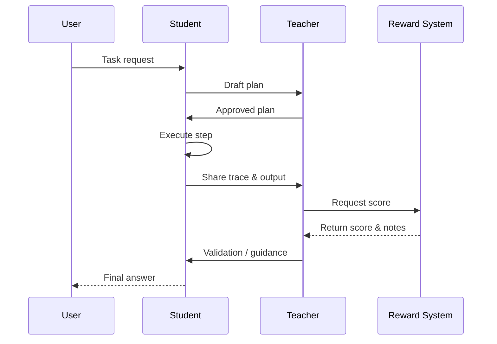

The Atlas SDK orchestrator is an orchestra conductor: it keeps every section in sync, brings instruments in at the right moment, and signals when the piece is ready for applause. Let’s walk through the score.

## The Runtime Workflow



1. **Plan Creation**: The `Student` proposes a step-by-step plan to accomplish the task (`Student.acreate_plan`).
2. **Plan Review**: The `Teacher` approves or rewrites the plan before execution begins (`Teacher.areview_plan`).
3. **Dependency Graph**: The orchestrator sorts the steps to ensure prerequisites run first (`atlas/runtime/orchestration/orchestrator.py`).
4. **Step Execution**: The `Student` executes each step, streaming tool calls and traces into the `ExecutionContext` (`Student.aexecute_step` powered by `atlas/runtime/orchestration/execution_context.py`).
5. **Validation Loop**: The `Teacher` validates the output of each step (`avalidate_step`). If validation fails, it can request guidance.
6. **Evaluation**: The Reward System scores the full attempt (`atlas/evaluation/evaluator.py`), publishing judge reasoning back through the runtime execution context. Scores below `0.6` (the runtime's default retry threshold) trigger another attempt.
7. **Final Synthesis**: Once all steps are successfully executed and validated, the `Student` combines the results into a final answer (`asynthesize_final_answer`).

## Retries & Guidance

Retries are surgical. When a judge score falls below the retry threshold (0.6), the orchestrator:

1. Calls `Teacher.agenerate_guidance` for actionable feedback.
2. Records the guidance in the execution context so it shows up in logs.
3. Replays the failing step with the new hints, up to `max_retries` attempts.

Use this to tune how forgiving the runtime should be: raise `max_retries` for high-stakes workflows, or keep it at 1 to fail fast.

## Event Stream & Telemetry

Every significant action is published to the `ExecutionContext` event stream. Subscribe to it to power CLI streams, dashboards, or custom logging.

```python
from atlas.runtime.orchestration.execution_context import ExecutionContext

context = ExecutionContext.get()
subscription = context.event_stream.subscribe(print)
```

- **Intermediate steps** – emitted when plans start/end, steps begin/finish, and tool calls fire.
- **Metadata** – stores guidance text, judge scores, and session metadata for later persistence.
- **Telemetry hooks** – The `atlas.core` module (`atlas/core/__init__.py`) allows a `TelemetryPublisher` to attach/detach. Dashboard documentation is coming later, so consider this a future-proofing hook.

## Anatomy of `atlas.core.run`

Open the `atlas.core` module (`atlas/core/__init__.py`) to see the high-level flow:

1. Load and validate the config (`atlas/config/loader.py`).
2. Create the agent adapter via `create_from_atlas_config`.
3. Optionally rewrite prompts, then instantiate Student, Teacher, and Evaluator.
4. Spin up the orchestrator and optional Postgres session logging.
5. Return an `atlas.types.Result` with the approved plan, per-step results, and final answer.

This is the same flow you triggered in the quickstart—just packaged for reuse.

## When to Customize

| If you want to… | Tweak |
|-----------------|-------|
| Stream events into your UI | Subscribe to the event stream or write a `TelemetryPublisher`. |
| Tighten quality control | Tweak the `rim` block (`active_judges`, `variance_threshold`, `uncertainty_threshold`) or add new judges. |
| Retry more aggressively | Raise `orchestration.max_retries` and tune guidance prompts. |
| Record every attempt | Enable `storage` and audit the persisted steps. |

## Next Steps

- Configure each YAML block in detail with the [`SDK Configuration Reference`](/sdk/configuration).
- Bring your own agent with the [`Bring Your Own Agent`](/sdk/adapters) guide.
- See how runtime roles compare to training in [`Student & Teacher Roles`](/sdk/student-teacher-roles).
