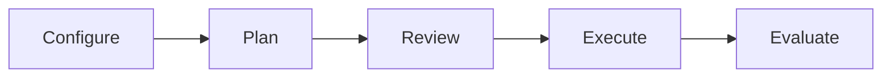

This guide provides the fastest path to running the Atlas SDK. Install the packaged runtime, point it at your agent, and execute your first task in a few commands—all while the adaptive runtime decides how much supervision each request needs.

<Note>
**Beta notice:** The Atlas SDK runtime is in beta. APIs and configuration keys may evolve—check release notes before upgrading.
</Note>

## Prerequisites

<Note>
Install the SDK directly from PyPI:
</Note>

1. **Install and upgrade the SDK**
   ```bash
   python -m pip install --upgrade arc-atlas
   ```
   <Tip>
   Working inside a virtual environment? Activate it first, then install the package.
   </Tip>
2. **Store your LLM credentials**
   ```bash
   export OPENAI_API_KEY="sk-your-key"
   ```
   <Tip>
   Using Azure OpenAI? Set the usual environment variables (`AZURE_OPENAI_API_KEY`, `AZURE_OPENAI_ENDPOINT`) and update the config’s provider/model entries before running.
   </Tip>
3. **Use a modern version of Python.** The SDK is tested with Python 3.10 and newer (the repo is developed with Python 3.13).

<Note>
We recommend keeping credentials in a `.env` file and loading them with `dotenv` or your process manager so they never land in shell history.
</Note>

## Step 1 – Run the Quickstart Task

The `configs/examples/openai_agent.yaml` configuration enables the adaptive runtime out of the box. It includes a small `storage` block so you can persist sessions immediately—set `storage: null` if you prefer purely in-memory runs.

Save the following snippet to a file (e.g., `run_atlas.py`).

```python
from atlas.core import run

result = run(
    task="Summarize the latest AI news",
    config_path="configs/examples/openai_agent.yaml",
    stream_progress=True,
)
print(result.final_answer)
```

<Info>
Alternatively, you can run the snippet directly in your terminal:
```bash
python -c "from atlas.core import run; result = run(task='Summarize the latest AI news', config_path='configs/examples/openai_agent.yaml', stream_progress=True); print(result.final_answer)"
```
</Info>

You should see an adaptive summary headline in the console stream (for example, `Adaptive: mode=coach confidence=0.58 certification=True`) followed by the usual plan-reason-synthesize loop. The runtime triages the request, runs a capability probe, chooses one of four lanes (`auto`, `paired`, `coach`, `escalate`), and then executes the Student↔Teacher loop with lane-specific supervision. `atlas.runtime.telemetry.ConsoleTelemetryStreamer` auto-enables when stdout is a TTY; force it on/off with `stream_progress=True/False` in the `run` call.

Need a local Postgres instance? The CLI ships with `atlas storage up`, which writes `atlas-postgres.yaml` and starts the database via Docker. Skip it (or tear it down) if you’re running without persistence.

### BYOA in 5 Minutes

Atlas wraps any agent that can expose either an OpenAI-compatible API, an HTTP endpoint, or a Python callable. Copy one of the starter configs in `configs/examples/` and adjust the `agent` block. For example, to target a local HTTP service:

```yaml
agent:
  type: http_api
  name: my-http-agent
  system_prompt: |
    You are the Atlas Student. Solve the task carefully and explain decisions.
  tools: []
  transport:
    base_url: http://localhost:8080/agent
    timeout_seconds: 60
```

Run it with the same snippet as above, swapping the `config_path`. Atlas will stream the plan, tool calls, and reward breakdowns as it executes your agent.

## What Just Happened?

Think of `atlas.core.run` as a project manager who never gets tired—now fronted by an adaptive controller:

- **Triage & probe** – a triage adapter builds context, the capability probe scores confidence, and the runtime picks a lane.
- **Configure** – the YAML tells the orchestrator which agent to call and how the Student/Teacher/Reward System trio should behave.
- **Plan** – the Student drafts a step-by-step approach when a stepwise lane is chosen; in single-shot lanes the plan collapses to one step.
- **Review** – the Teacher approves or tweaks the plan (or just inspects the final answer in `paired` mode).
- **Execute** – each step runs with lane-specific guidance, validation, and retries.
- **Evaluate** – the Reward System scores the work, deciding whether to reuse guidance and how to update persona memories.



## Configuration Breakdown

The `openai_agent.yaml` config defines the runtime behavior. Here’s a high-level look at the key sections:

- **`agent`**: Specifies the agent to run the task. The quickstart uses the OpenAI adapter with `gpt-4o-mini` and no tools, requiring only an `OPENAI_API_KEY`.
- **`student`**: Configures the planner, executor, and synthesizer roles with their respective prompts and token limits.
- **`teacher`**: Defines the review and guidance agent, which also has its own model and token budget.
- **`orchestration`**: Sets runtime parameters like the number of retries (default: 1) and step timeouts.
- **`rim`** (Reward System): Defines the judges and arbiter that score the final answer for quality and helpfulness. This score determines if a retry is needed.
- **`adaptive_teaching`**: Controls the triage adapter, capability probe thresholds, certification policy, default tags, and reward overrides. See the [`Configuration reference`](/sdk/configuration#adaptive_teaching) and the [Adaptive Runtime guide](/runtime_adaptive_flow) for details.
- **`storage`**: Point at Postgres to persist episodes; remove the block or set it to `null` for in-memory experiments.
- **`student.prompts` / `teacher.prompts`**: Optional overrides. Atlas derives persona text from `atlas.prompts`; customize behaviour by editing these prompt blocks directly.

To add tools, enable persistence, or use a different agent, switch the `config_path` to another template in `configs/examples/` (e.g., `http_agent.yaml`, `python_agent.yaml`) and see the `SDK Configuration` reference for details.

## Troubleshooting Checklist

- **Missing API key** – ensure `OPENAI_API_KEY` (or Azure equivalents) are exported in the same shell.
- **Time spent downloading dependencies** – editable installs pull in `litellm`, `httpx`, and friends on the first run; subsequent runs are instant.
- **Model limits** – bump `max_output_tokens` in the config if your summaries get truncated.

## Next Steps

- Persist sessions and build datasets with [`Export Runtime Traces`](/sdk/export-traces), then follow the training loop in [`Quickstart`](/quickstart).
- Dive into [`SDK Configuration`](/sdk/configuration) to customize each YAML block and the [`Adaptive Runtime Guide`](/runtime_adaptive_flow) to understand the triage → probe → lane controller.
- Learn how the planner, reviewer, and evaluator cooperate in [`How Orchestration Works`](/sdk/orchestration).
- Wrap your own agent with the adapters in [`Bring Your Own Agent`](/sdk/adapters).
- Compare runtime vs training expectations in [`Student & Teacher Roles`](/sdk/student-teacher-roles).
