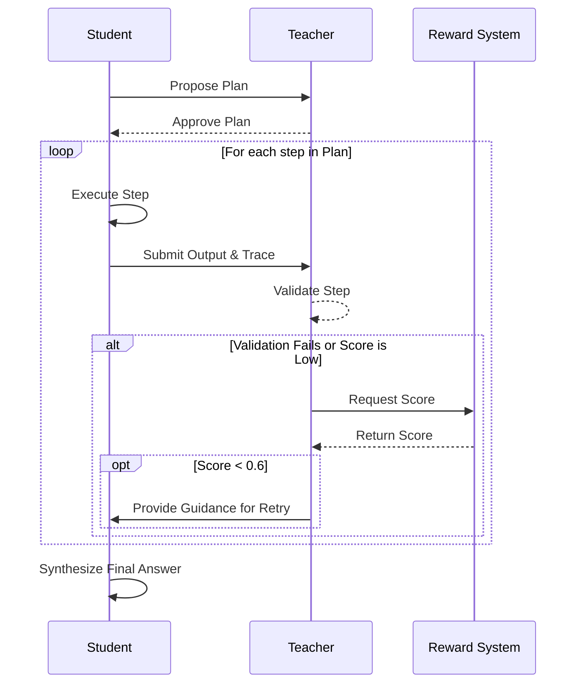

In Atlas, the terms “Student” and “Teacher” are used in two primary contexts: the SDK runtime and model training. While the names are the same, their responsibilities shift.

<Note>
**Runtime vs. Training:** The SDK runtime focuses on orchestrating an existing agent to complete a task. Model training focuses on optimizing a model’s performance for future tasks. For the conceptual overview, start with the [`Teacher-Student Paradigm`](/concepts/teacher-student-paradigm).
</Note>

## Two Contexts, One Vocabulary

| Context | Student | Teacher | Primary Goal |
|---------|---------|---------|---------------|
| **SDK Runtime** | The planner, executor, and synthesizer that calls your agent. | The plan reviewer, output validator, and guidance author. | Deliver a reliable answer for the current task. |
| **Model Training** | The model being improved (e.g., a new policy checkpoint). | The supervising model providing feedback during optimization. | Improve the long-term performance of the Student model. |

The runtime roles now live in `atlas/personas/`, while the training roles are part of the broader Atlas training system. Runtime orchestration leans on shared LangGraph helpers in `atlas.runtime.agent_loop`, and persona prompts are generated via `atlas.prompts`.

## The Runtime Student

Located in `atlas/personas/student.py`, the runtime Student performs three key actions:

1. **Plan**: Creates a dependency graph to solve the task (`acreate_plan`). The prompt for this is set in `student.prompts.planner`.
2. **Execute**: Runs each step from the plan, calling any necessary tools or adapters (`aexecute_step`).
3. **Synthesize**: Compiles the results from all steps into a final answer for the user (`asynthesize_final_answer`).

Key configuration levers include prompt templates (`student.prompts`), token budgets (`max_*_tokens`), and tool behavior (`tool_choice`).

## The Runtime Teacher

Defined in `atlas/personas/teacher.py`, the runtime Teacher acts as the quality assurance layer.

1. **Plan Review**: Approves or rejects the Student's plan before execution (`areview_plan`).
2. **Validation**: Checks the output of each step to ensure it meets quality standards (`avalidate_step`).
3. **Guidance**: If an output is poor, it generates feedback to guide the Student on the next attempt (`agenerate_guidance`).

Configuration options include the Teacher's LLM (`teacher.llm`), token limits for feedback (`max_review_tokens`), and plan caching (`plan_cache_seconds`).

## The Runtime Feedback Loop

The Student and Teacher collaborate in a tight loop to ensure quality.

1. The Teacher must approve the Student's plan before any work begins.
2. After each step, the Teacher validates the output. If the output is low-quality, it engages the Reward System.
3. If the Reward System's score is below the default retry threshold (0.6), the Teacher generates guidance, and the Student attempts the step again.
4. Once all steps pass validation, the Student synthesizes the final answer.

## Summary: Runtime vs. Training

To keep the contexts clear, remember this summary:

- In the **SDK runtime**, the Student is the *doer* (planner/executor) and the Teacher is the *reviewer*.
- In **model training**, the Student is the *model being improved*, and the Teacher is the *expert coach* providing feedback.

When you see documentation referencing GEPA, GRPO, or reward shaping, you are in the training context. When you see talk of adapters and orchestration, you are in the SDK runtime context.

## Next Steps

- Explore the YAML knobs in [`SDK Configuration`](/sdk/configuration).
- See the Student and Teacher in motion in [`How Orchestration Works`](/sdk/orchestration).
- Jump into training workflows with the [Training Quickstart](/quickstart) or the [Offline Training guide](/training/offline/grpo-training).
