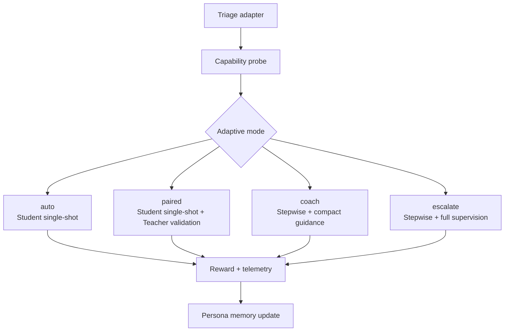

In Atlas, the terms “Student” and “Teacher” are used in two primary contexts: the SDK runtime and model training. While the names are the same, their responsibilities shift.

<Note>
**Runtime vs. Training:** The SDK runtime focuses on orchestrating an existing agent to complete a task. Model training focuses on optimizing a model’s performance for future tasks. For the conceptual overview, start with the [`Teacher-Student Paradigm`](/concepts/teacher-student-paradigm).
</Note>

## Two Contexts, One Vocabulary

| Context | Student | Teacher | Primary Goal |
|---------|---------|---------|---------------|
| **SDK Runtime** | The planner, executor, and synthesizer that calls your agent. | The plan reviewer, output validator, and guidance author. | Deliver a reliable answer for the current task. |
| **Model Training** | The model being improved (e.g., a new policy checkpoint). | The supervising model providing feedback during optimization. | Improve the long-term performance of the Student model. |

The runtime roles now live in `atlas/personas/`, while the training roles are part of the broader Atlas training system. Every runtime episode also flows through the adaptive controller described in [`adaptive_teaching`](/sdk/configuration#adaptive_teaching): triage builds the dossier, a capability probe chooses a lane, and then the Student/Teacher pair behave differently depending on whether the mode is `auto`, `paired`, `coach`, or `escalate`.

## The Runtime Student

Located in `atlas/personas/student.py`, the runtime Student performs three key actions:

1. **Plan**: Creates a dependency-aware plan (`acreate_plan`) when the selected lane is stepwise (`coach` / `escalate`). In single-shot lanes (`auto` / `paired`), the plan collapses to a single synthetic step. The prompt lives in `student.prompts.planner`.
2. **Execute**: Runs either the single-shot step or each step from the reviewed plan, calling any necessary tools or adapters (`aexecute_step`). Lane choice controls whether retries are allowed.
3. **Synthesize**: Compiles results into a final answer (`asynthesize_final_answer`). In `paired` mode the Teacher may validate only the final answer; in stepwise lanes synthesis happens after every validated step completes.

Key configuration levers include prompt templates (`student.prompts`), token budgets (`max_*_tokens`), and tool behavior (`tool_choice`).

## The Runtime Teacher

Defined in `atlas/personas/teacher.py`, the runtime Teacher acts as the quality assurance layer.

1. **Plan Review**: Approves or rewrites the Student's plan (`areview_plan`). In `auto`/`paired`, this may be skipped entirely if the runtime converts the task into a single-shot step.
2. **Validation**: Validates either the final answer (`paired`) or every step (`coach`/`escalate`) via `avalidate_step`. The Teacher also records certification verdicts when the lane is `paired`.
3. **Guidance**: When validation fails or the reward score is below the retry threshold, the Teacher generates guidance (`agenerate_guidance`) that is fed back into the next attempt and logged inside the execution context.

Configuration options include the Teacher's LLM (`teacher.llm`), token limits for feedback (`max_review_tokens`), and plan caching (`plan_cache_seconds`).

## The Runtime Feedback Loop

The Student and Teacher collaborate differently depending on the adaptive mode. All lanes still capture telemetry, reward, and persona updates.

1. The Teacher reviews or rewrites the plan when the chosen lane is stepwise. In single-shot lanes the plan is condensed and executed immediately.
2. Validation happens either once (`paired`) or after every step (`coach`/`escalate`). Auto runs skip validation to prioritise latency.
3. If a lane permits retries and the reward score falls below the retry threshold (default: 0.6), the Teacher issues guidance and the Student replays the step with that context.
4. After completion, the orchestrator persists `adaptive_summary`, `session_reward`, and persona updates so the next run can reuse the outcome.

## Summary: Runtime vs. Training

To keep the contexts clear, remember this summary:

- In the **SDK runtime**, the Student is the *doer* (planner/executor) and the Teacher is the *reviewer*, with their exact responsibilities modulated by the adaptive lane chosen for that task.
- In **model training**, the Student is the *model being improved*, and the Teacher is the *expert coach* providing feedback.

When you see documentation referencing GRPO or reward shaping, you are in the Atlas Core training context. Discussions about continual learning now live in the SDK runtime documentation.

## Next Steps

- Explore the YAML knobs in [`SDK Configuration`](/sdk/configuration) and dive deeper into lanes with the [`Adaptive Runtime Guide`](/runtime_adaptive_flow).
- See the Student and Teacher in motion in [`How Orchestration Works`](/sdk/orchestration).
- Jump into training workflows with the [Training Quickstart](/quickstart) or the [Offline Training guide](/training/offline/grpo-training).
