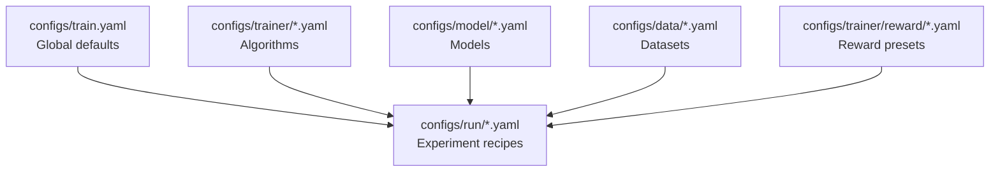

Atlas Core uses Hydra to compose model, dataset, trainer, and reward presets. This page is a complete parameter reference for launching GRPO, GKD, or SFT jobs.

<Note>
For workflow guides, see [GRPO Training](/training/offline/grpo-training) or [GKD Training](/training/offline/gkd-training). This page focuses on exhaustive parameter lookup.
</Note>

## Training Method Comparison

| Method | When to Use | Speed | Data Requirement | Output |
|--------|-------------|-------|------------------|--------|
| **GRPO** | Train from rewards (RL) | 24-48h | Runtime traces with reward signals | RL-optimized teacher |
| **GKD** | Distill large \u2192 small teacher | 4-8h (9-30× faster than GRPO) | Strong teacher exists | Compressed teacher |
| **SFT** | Supervised warmup | 2-4h | Approved conversational traces | Baseline teacher |

→ Full comparison in [Offline Training Guide](/training/offline/grpo-training)

## Hydra Composition Map

Hydra builds a training run by merging defaults from each config group:



| Layer | Example Files | When to Modify |
|-------|---------------|----------------|
| `train.yaml` | `configs/train.yaml` | Global logging/output rules |
| `model@_global_` | `qwen3_8b.yaml`, `base.yaml` | Swap checkpoints, quantization |
| `data@_global_` | `runtime_traces.yaml`, `arc_atlas_rl.yaml` | Choose datasets, sampling |
| `trainer@_global_` | `grpo.yaml`, `base_sft.yaml`, `teacher_grpo.yaml` | Algorithm, optimizer, batching |
| `run@_global_` | `teacher_rcl.yaml`, `teacher_sft.yaml` | Pre-built experiment bundles |
| `reward@_global_` | `rim_teaching.yaml` | Reward adapter, prompt templates |

---

## Model Presets (`configs/model/`)

| Parameter | Default | When to Change |
|-----------|---------|----------------|
| `model_name_or_path` | Required (e.g., `Qwen/Qwen3-8B`) | Every run - specify checkpoint |
| `tokenizer_name_or_path` | `${model_name_or_path}` | Distinct tokenizer needed |
| `trust_remote_code` | `true` | Vendor-specific architectures |
| `use_peft` | `false` | Enable LoRA/PEFT adapters |
| `load_in_4bit` | `false` | GPU memory constrained |
| `tokenizer.padding_side` | `left` | Keeps RL rollouts aligned |
| `unsafe_tokenizer_loading` | `false` | Untrusted tokenizer code |
| `torch_dtype` | `bfloat16` (qwen3_8b) | Hardware-specific precision |
| `attn_implementation` | `flash_attention_2` | Faster attention on supported GPUs |

---

## Dataset Presets (`configs/data/`)

| Parameter | Default | When to Change |
|-----------|---------|----------------|
| `dataset_id_or_path` | `Arc-Intelligence/Arc-ATLAS-Teach-v0` | HuggingFace hub ID or local path |
| `dataset_split` | `rl`, `train` | Multi-split datasets |
| `dataset_level_filter` | `null` (e.g., `level_4_5` for BigMath) | Curriculum control |
| `dataset_max_samples` | `null` | Subsample for quick experiments |
| `eval_split_ratio` | `0.1` | Define held-out eval share |
| `shuffle` | `true` (`runtime_traces`) | Randomize JSONL before split |
| `completion_only_training` | `True` (`arc_atlas_sft`) | Trim prompts in SFT |
| `dataset_path` | `traces/export.jsonl` (`runtime_traces`) | Point at exported JSONL |
| `make_dataset_fn._target_` | `custom_data.runtime_trace_data.get_runtime_trace_dataset` | Loader entrypoint |

**Common Dataset Configs:**
- `runtime_traces.yaml` - Exported JSONL from Atlas SDK
- `arc_atlas_rl.yaml` - Pre-collected RL dataset
- `arc_atlas_sft.yaml` - Supervised fine-tuning dataset

---

## Trainer Base Defaults (`configs/trainer/base.yaml`)

| Parameter | Default | When to Change |
|-----------|---------|----------------|
| `max_steps` | `450` | Override in run recipe |
| `num_train_epochs` | `1` | Mutually exclusive with max_steps |
| `train_batch_size` | `64` | Effective batch across devices |
| `per_device_train_batch_size` | `2` | Per-rank micro batch |
| `gradient_accumulation_steps` | Inferred | Auto-computed if omitted |
| `gradient_checkpointing` | `true` | Memory savings for long contexts |
| `learning_rate` | `5e-7` | Baseline LR for RL |
| `weight_decay` | `0` | Regularization needed |
| `max_grad_norm` | `1.0` | Gradient clipping value |
| `lr_scheduler_type` | `"cosine"` | Constant/linear schedules |
| `warmup_ratio` | `0.03` | Warmup fraction of total steps |
| `bf16` / `tf32` | `true` / `true` | Mixed-precision on supported GPUs |
| `ddp_timeout` | `18000` seconds | Distributed training timeout |

<Info>
`gradient_accumulation_steps` is auto-computed: `train_batch_size / (per_device_train_batch_size × num_devices)`. Provide any two values; the launcher resolves the third (see `train.py:55-103`).
</Info>

---

## GRPO Algorithm Controls (`configs/trainer/grpo.yaml`)

| Parameter | Default | When to Change |
|-----------|---------|----------------|
| `max_steps` | `200` | Override base default |
| `train_batch_size` | `252` | Must divide evenly by devices |
| `per_device_train_batch_size` | `3` | Increase for fewer devices |
| `num_generations` | `null` | Limit for budget control |
| `learning_rate` | `1e-6` | RL-specific step size |
| `beta` | `0.04` | KL penalization strength |
| `max_prompt_length` / `max_completion_length` | `2048` / `16384` | Truncate input/output |
| `shuffle_generation_inputs` | `true` | Shuffle prompts before generation |
| `temperature` / `top_p` / `top_k` / `min_p` | `1.0` / `1.0` / `null` / `null` | Sampling controls for rollouts |
| `repetition_penalty` | `1.0` | Discourage repetition |
| `use_vllm` | `true` | Fast generation (recommended) |
| `vllm_device` | `"auto"` | Auto-select devices |
| `vllm_gpu_memory_utilization` | `0.9` | Cap GPU memory per worker |
| `vllm_dtype` | `"auto"` | Hardware-based dtype |
| `vllm_max_model_len` | `null` | Override max context length |
| `use_ray` | `false` | Remote vLLM via Ray |
| `ray_tensor_parallelism` | `1` | Split model across GPUs |
| `enable_prefix_caching` | `false` | Cache prompt prefixes |
| `enforce_eager` | `true` | PyTorch eager execution (safer debugging) |
| `use_vllm_server` | `false` | External vLLM server |
| `vllm_host` / `vllm_port` | `null` / `null` | Required if use_vllm_server=true |
| `reward_weights` | `null` | Per-judge scaling factors |
| `sync_ref_model` | `false` | Keep reference model in sync |
| `ref_model_sync_steps` | `64` | Sync frequency (steps) |
| `unbias_log_probabilities` | `true` | Correct for temperature scaling |
| `log_completions` | `false` | Store sampled completions |
| `push_to_hub` | `false` | Publish to HuggingFace Hub |
| `activate_debugging_logs` | `false` | Extra diagnostics |

---

## Teacher GRPO Overlay (`configs/trainer/teacher_grpo.yaml`)

Extends base GRPO with diagnostic prompts and teacher-specific controls.

| Parameter | Default | When to Change |
|-----------|---------|----------------|
| `trainer_log_name` | `teacher_grpo_rw_${reward_log_name}` | Appends reward preset name |
| `logging_prob` | `0.1` | Fraction of episodes logged |
| `student_model` | `null` | Co-train student alongside teacher |
| `use_reference_teacher_model` | `false` | Compare vs static reference |
| `completion_only_training` | `false` | Completion-only datasets |
| `trainer_args.max_probe_tokens` | `500` | Diagnostic prompt budget |
| `trainer_args.student_diagnostic_template` | Multiline | Reflection prompt (see below) |
| `trainer_args.teacher_adaptive_template` | Multiline | Guidance prompt (see below) |
| `trainer_args.student_with_teaching_template` | Multiline | Apply feedback prompt (see below) |

**Default Prompt Templates:**

```yaml
student_diagnostic_template: |
  Question: {question}
  Before solving, briefly describe:
  1. What type of problem this is
  2. The key concepts or steps needed
  3. Any potential challenges you see

teacher_adaptive_template: |
  Question: {question}
  Student's approach: {approach}

  <thinking>
  [Analyze student approach]
  </thinking>

  <teaching>
  [Only guidance to student - no answers]
  </teaching>

student_with_teaching_template: |
  Question: {question}
  A teacher has provided: {teaching}

  Now solve step by step.
  <solution></solution>
```

---

## SFT Trainer (`configs/trainer/base_sft.yaml`)

| Parameter | Default | Run Override (`teacher_sft.yaml`) | When to Change |
|-----------|---------|-----------------------------------|----------------|
| `num_train_epochs` | `1` | `10` | Longer supervised training |
| `max_steps` | `-1` | `-1` | Negative disables step cap |
| `train_batch_size` | `64` | `16` | Effective batch for SFT |
| `per_device_train_batch_size` | `4` | `1` | Pair with gradient accum |
| `learning_rate` | Base: `5e-7`, SFT: `2e-4` | `2e-4` | Higher LR for SFT |
| `lr_scheduler_type` | `"cosine"` | `"constant"` | SFT prefers constant |
| `warmup_ratio` | `0.03` | `0.1` | Warm start for supervised |
| `max_seq_length` | `4096` | `16384` | Match runtime telemetry |
| `packing` | `true` | `false` | Disable for long contexts |
| `do_eval` | `true` | `false` | Enable with validation splits |
| `ddp_timeout` | `18000` | `180000000` | Long sequences across ranks |

---

## Run Recipes (`configs/run/`)

Pre-built experiment bundles that override multiple config groups.

| Recipe | Key Overrides | Use Case |
|--------|---------------|----------|
| `default.yaml` | Empty (inherit globals) | CLI override experiments |
| `teacher_rcl.yaml` | Model: `qwen3_8b`, Data: `arc_atlas_rl`, Trainer: `teacher_grpo`, Batch: 128, vLLM server enabled | Production GRPO for reward-conditioned learning |
| `teacher_sft.yaml` | Trainer: `base_sft`, Data: `arc_atlas_sft`, Epochs: 10, Max seq: 16384 | Supervised warmup before GRPO |

---

## Reward Preset (`configs/trainer/reward/rim_teaching.yaml`)

| Parameter | Default | When to Change |
|-----------|---------|----------------|
| `reward_log_name` | `rim_teaching` | Propagates to trainer logs |
| `max_probe_tokens` | `500` | Diagnostic prompt length |
| `teacher_reward._target_` | `RIM.reward_adapter.RIMReward` | Uses `rim_offline_config.yaml` |
| `student_model` / `teacher_model` / `tokenizer` | `null` | Auto-populated from Hydra model |

### Reward Configs (Runtime vs Offline)

| Setting | Runtime (`rim_config.yaml`) | Offline (`rim_offline_config.yaml`) |
|---------|----------------------------|-------------------------------------|
| `temperatures` | `[0.2, 0.5, 0.8]` | `[0.2, 0.5, 0.8]` |
| `models.small_model` | `"gemini/gemini-2.5-flash"` | `"gemini/gemini-2.5-flash"` |
| `models.large_model` | `"gemini/gemini-2.5-pro"` | `"gemini/gemini-2.5-pro"` |
| `active_judges` | accuracy, helpfulness, process, diagnostic (all true) | helpfulness, process (accuracy/diagnostic false) |
| `anti_gaming.cap_score` | `0.3` | `0.3` |
| `parallel_execution.max_workers` | `8` | `8` |

---

## Next Steps

<CardGroup cols="3">
  <Card title="GRPO Training" icon="dumbbell" href="/training/offline/grpo-training">
    Launch reward-conditioned learning runs
  </Card>
  <Card title="GKD Training" icon="compress" href="/training/offline/gkd-training">
    Distill large teachers into small models
  </Card>
  <Card title="Reward System" icon="trophy" href="/concepts/reward-design">
    Judge design, weights, escalation
  </Card>
</CardGroup>
