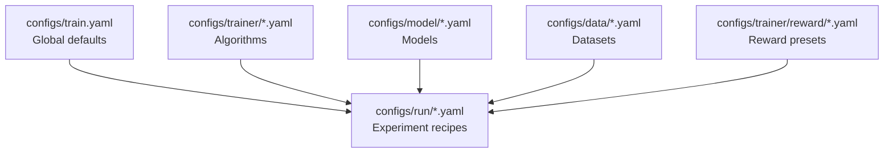

Atlas Core uses Hydra to compose model, dataset, trainer, and reward presets. This page is a reference for those configuration blocks so you can launch GRPO or SFT jobs with confidence.

<Note>
For a conceptual tour of the end-to-end workflow, start with the offline guides under [`Training / Offline`](/training/offline/grpo-training). This page focuses on the exhaustive parameter reference.
</Note>

## End-to-End Loop Orientation

<Steps>
  <Step title="Run the SDK runtime">
    Wrap your production agent with the SDK config, then call `atlas.core.run(..., stream_progress=True)` to capture adaptive episodes.
  </Step>
  <Step title="Export telemetry">
    When Postgres storage is enabled, export runtime traces with `arc-atlas --database-url ... --output traces.jsonl`. Each session line matches the dataset schema consumed by Atlas Core.
  </Step>
  <Step title="Train with Hydra">
    Launch `python scripts/run_offline_pipeline.py --export-path traces.jsonl` (or invoke `train.py --config-name <recipe>`) to compose the model, data, trainer, and reward presets documented below.
  </Step>
</Steps>

## Hydra Composition Map

Hydra builds a training run by merging defaults from each config group. The diagram below shows the composition order; deeper layers override earlier ones.



### Layer Summary

| Layer | Example files | When to modify |
| --- | --- | --- |
| `train.yaml` | `configs/train.yaml` | Global logging/output rules shared across recipes. |
| `model@_global_` | `configs/model/base.yaml`, `configs/model/qwen3_8b.yaml` | Swap checkpoints, quantisation, tokenizer behaviour. |
| `data@_global_` | `configs/data/runtime_traces.yaml`, `arc_atlas_rl.yaml`, `arc_atlas_sft.yaml` | Choose datasets, sampling windows, preprocessing. |
| `trainer@_global_` | `configs/trainer/base.yaml`, `grpo.yaml`, `base_sft.yaml`, `teacher_grpo.yaml` | Optimiser, batching, RL algorithm knobs. |
| `run@_global_` | `configs/run/teacher_rcl.yaml`, `configs/run/teacher_sft.yaml` | Pre-built experiment bundles that override multiple groups at once. |
| `reward@_global_` | `configs/trainer/reward/rim_teaching.yaml` | Prompt templates and reward adapter selection. |

## Reference Tables

### Model Presets (`configs/model/`)

| Parameter | Default / Example | Notes |
| --- | --- | --- |
| `model_name_or_path` | Required (e.g., `Qwen/Qwen3-8B` in `qwen3_8b.yaml`) | Override in run configs to target a different checkpoint. |
| `tokenizer_name_or_path` | `${model_name_or_path}` | Point at a distinct tokenizer if the checkpoint bundle omits one. |
| `model_args._target_` | `hydra_utils.trl.ModelConfig` | Hydra factory that loads Transformers/TRL models. |
| `model_args.trust_remote_code` | `true` | Needed for vendor-specific architectures; set `false` only for audited code. |
| `use_peft` | `false` | Toggle LoRA/PEFT adapters globally. |
| `load_in_4bit` | `false` | Enable quantised loading when GPU memory is tight. |
| `tokenizer.padding_side` | `left` | Keeps RL roll-outs aligned. |
| `unsafe_tokenizer_loading` | `false` | Flip only if the tokenizer requires untrusted code. |
| `make_tokenizer_fn._target_` | `hydra_utils.fix_pad_token` | Ensures pad token alignment with the model. |
| `peft_config._target_` | `hydra_utils.trl.get_peft_config` | Automatically derives PEFT configuration from `use_peft`. |
| `qwen3_8b.yaml` overrides | `model_args.model_revision: main`, `torch_dtype: bfloat16`, `attn_implementation: flash_attention_2` | Treat as a template for adding new architectures. |

### Dataset Presets (`configs/data/`)

| Parameter | Default / Example | Notes |
| --- | --- | --- |
| `dataset_id_or_path` | `Arc-Intelligence/Arc-ATLAS-Teach-v0`, `open-r1/Big-Math-RL-Verified-Processed`, etc. | Accepts Hugging Face hub IDs or local paths. |
| `dataset_split` | `rl`, `train`, etc. | Required for multi-split datasets (see `arc_atlas_rl.yaml:2`). |
| `dataset_level_filter` | `level_4_5` (BigMath example) | Optional filter for curriculum control. |
| `dataset_max_samples` | `null` | Set to an integer to subsample for quick experiments. |
| `eval_split_ratio` | `0.1` (`runtime_traces.yaml`, `arc_atlas_rl.yaml`) | Defines held-out evaluation share when a dataset lacks splits. |
| `shuffle` | `true` (`runtime_traces.yaml`) | Randomises JSONL runtime traces before splitting. |
| `completion_only_training` | `True` (`arc_atlas_sft.yaml`) | Trim prompts when finetuning on completion-only SFT datasets. |
| `custom_start_of_response` / `keep_columns` / `add_dataset_indices` | Defaults `~` / `~` / `False` (`arc_atlas_sft.yaml`) | Configure SFT formatting and metadata retention. |
| `data_log_name` | e.g., `arc_atlas_rl`, `runtime_traces` | Feeds the Hydra logging name (`configs/data/*.yaml` line 5). |
| `dataset_path` | `traces/export.jsonl` (`runtime_traces.yaml`) | Point at exported JSONL from the runtime SDK. |
| `make_dataset_fn._target_` | `custom_data.runtime_trace_data.get_runtime_trace_dataset`, `custom_data.arc_atlas_rl_data.get_arc_atlas_rl_dataset`, `custom_data.sft_data.load_formatted_sft_dataset` | Loader entrypoints for runtime, RL, and SFT data respectively. |

### Trainer Base Defaults (`configs/trainer/base.yaml`)

| Parameter | Default | Notes |
| --- | --- | --- |
| `max_steps` | `450` | Global cap unless a run recipe overrides it. |
| `num_train_epochs` | `1` | Mutually exclusive with `max_steps` when set > 0. |
| `train_batch_size` | `64` | Effective batch across all devices. |
| `per_device_train_batch_size` | `2` | Per-rank micro batch size. |
| `gradient_accumulation_steps` | Inferred | Computed if omitted (see formula below). |
| `gradient_checkpointing` | `true` | Saves memory during long contexts. |
| `gradient_checkpointing_kwargs.use_reentrant` | `false` | Compatible with PyTorch eager execution. |
| `learning_rate` | `5e-7` | Baseline LR for RL fine-tuning. |
| `weight_decay` | `0` | Set >0 when applying regularisation. |
| `adam_beta1` / `adam_beta2` / `adam_epsilon` | `0.9` / `0.999` / `1e-8` | Standard Adam defaults. |
| `max_grad_norm` | `1.0` | Gradient clipping value. |
| `lr_scheduler_type` | `"cosine"` | Override for constant/linear schedules. |
| `lr_scheduler_kwargs` | `null` | Provide dict for scheduler-specific arguments. |
| `warmup_ratio` | `0.03` | Warmup fraction of total steps. |
| `bf16` / `tf32` | `true` / `true` | Enable mixed-precision features on supported GPUs. |
| `ddp_timeout` | `18000` seconds | Applies to distributed training rendezvous. |
| `trainer_args._target_` | _(set by derived trainers)_ | Base config leaves the target blank; algorithm-specific files provide it. |

<Info>
`gradient_accumulation_steps` is inferred at runtime using `gradient_accumulation_steps = train_batch_size / (per_device_train_batch_size × number_of_devices)` (see `train.py:55-103`). Provide any two values and the launcher resolves the third.
</Info>

### GRPO Algorithm Controls (`configs/trainer/grpo.yaml`)

| Parameter | Default | Notes |
| --- | --- | --- |
| `trainer_log_name` | `grpo` | Used in WandB run naming. |
| `artificial_epochs` | `1` | Replays the dataset without increasing `num_train_epochs`. |
| `max_steps` | `200` | Overrides the base default when GRPO is active. |
| `train_batch_size` | `252` | Must be divisible by `per_device_train_batch_size × number_of_devices`; adjust to match your hardware. |
| `per_device_train_batch_size` | `3` | Increase when running on fewer devices. |
| `num_generations` | `null` | Limit generations per prompt for budget control. |
| `learning_rate` | `1e-6` | RL-specific optimiser step size. |
| `beta` | `0.04` | Controls KL penalisation strength. |
| `model_init_kwargs` | `null` | Pass init kwargs to the policy model when required. |
| `remove_unused_columns` | `false` | Leave dataset columns intact for custom collators. |
| `max_prompt_length` / `max_completion_length` | `2048` / `16384` | Truncate input and sampled output lengths. |
| `shuffle_generation_inputs` | `true` | Shuffles prompts before generation. |
| `ds3_gather_for_generation` | `true` | Optimises DeepSpeed ZeRO3 gather for generation. |
| `temperature` / `top_p` / `top_k` / `min_p` | `1.0` / `1.0` / `null` / `null` | Sampling controls for on-policy roll-outs. |
| `repetition_penalty` | `1.0` | Adjust to discourage repetition. |
| `generation_aggregation_steps` | `null` | Set to aggregate rewards across multiple generations. |
| `use_vllm` | `true` | Enable vLLM for fast generation. |
| `vllm_device` | `"auto"` | Auto-select devices for vLLM. |
| `vllm_gpu_memory_utilization` | `0.9` | Cap GPU memory usage per vLLM worker. |
| `vllm_dtype` | `"auto"` | Choose dtype automatically based on hardware. |
| `vllm_max_model_len` | `null` | Override maximum context length for vLLM. |
| `use_ray` | `false` | Enable when serving vLLM remotely through Ray. |
| `ray_share_training_devices` | `false` | Prevent inference from consuming training GPUs by default. |
| `ray_tensor_parallelism` | `1` | Increase to split models across GPUs. |
| `ray_data_parallelism` | `null` | Provide when scaling inference horizontally. |
| `ray_no_memory_duplication` | `false` | Enable to reduce duplicate model weights. |
| `vllm_sleep_level` | `0` | Lower latency vs. energy consumption trade-off. |
| `enable_prefix_caching` | `false` | Cache prompt prefixes for vLLM if memory permits. |
| `enforce_eager` | `true` | Keeps PyTorch eager execution (safer debugging). |
| `use_vllm_server` | `false` | Switch to true when pointing at an external vLLM server. |
| `vllm_host` / `vllm_port` | `null` / `null` | Required when `use_vllm_server` is true. |
| `vllm_group_port` | `51216` | Group communication port for distributed vLLM. |
| `num_vllm_clients` | `1` | Increase for higher inference throughput. |
| `reward_weights` | `null` | Provide per-judge scaling factors when combining rewards. |
| `sync_ref_model` | `false` | Enable to keep a reference model in sync. |
| `ref_model_mixup_alpha` | `0.9` | KL interpolation weight when syncing ref model. |
| `ref_model_sync_steps` | `64` | Frequency (in steps) for syncing the reference model. |
| `backprop_accumulation_steps` / `backprop_accumulation_micro_batch_size` | `null` / `null` | Explicitly set to override automatic accumulation. |
| `offload_untrained_models` | `false` | Offload inactive models to CPU. |
| `unbias_log_probabilities` | `true` | Corrects log-probabilities for temperature scaling. |
| `log_completions` | `false` | Enable to store sampled completions. |
| `save_completions_probability` | `null` | Sample rate for saved completions when logging. |
| `push_to_hub` | `false` | Flip to publish checkpoints to Hugging Face Hub. |
| `activate_debugging_logs` | `false` | Emits extra diagnostics during training. |
| `trainer_args._target_` | `trainers.GRPOConfig` | Hydrated with the same fields above. |
| `trainer._target_` | `trainers.GRPOTrainer` | Main GRPO training loop implementation. |

### Teacher GRPO Overlay (`configs/trainer/teacher_grpo.yaml`)

| Parameter | Default / Example | Notes |
| --- | --- | --- |
| `trainer_log_name` | `teacher_grpo_rw_${reward_log_name}` | Appends reward preset name for clarity. |
| `reward_fns` | `_target_: hydra_utils.wrap_as_list` | Wraps the `teacher_reward` callable from the reward preset. |
| `logging_prob` | `0.1` | Fraction of episodes logged for analysis. |
| `student_model` / `student_model_init_kwargs` | `null` | Provide when co-training a student alongside the teacher. |
| `use_reference_teacher_model` | `false` | Enable to compare against a static reference teacher. |
| `completion_only_training` | `false` | Set `true` when feeding completion-only datasets. |
| `disable_student_offloading` | `false` | Keep student parameters on GPU when necessary. |
| `trainer_args.max_probe_tokens` | `500` | Highest token budget for diagnostic prompts. |
| `trainer_args.student_diagnostic_template` | Multiline template | See **Default prompt templates** below. |
| `trainer_args.teacher_adaptive_template` | Multiline template | See **Default prompt templates** below. |
| `trainer_args.student_with_teaching_template` | Multiline template | See **Default prompt templates** below. |
| `trainer._target_` | `trainers.TeacherGRPOTrainer` | Specialised trainer that incorporates diagnostic prompts. |

<details>
  <summary><strong>Default prompt templates</strong></summary>

```yaml
student_diagnostic_template: |
  Question: {question}

  Before solving, briefly describe:
  1. What type of problem this is
  2. The key concepts or steps needed
  3. Any potential challenges you see

  Your initial approach (be concise):

teacher_adaptive_template: |
  Question: {question}

  Student's approach: {approach}

  First, think about the student's approach (use <thinking> tags for your internal analysis).
  Then provide your teaching guidance (use <teaching> tags for what you'll tell the student).

  <thinking>
  [Analyze the student's approach here - is it correct? What misconceptions might they have? What's the next step they need?]
  </thinking>

  <teaching>
  [Only your guidance to the student goes here. Be concise for correct approaches, more detailed for wrong ones.]
  </teaching>

  Rules:
  - Keep <thinking> and <teaching> separate
  - NEVER solve the problem or give the answer in <teaching>
  - <teaching> should only contain guidance, not your thought process
  - Focus on guiding the student to provide correct answers

student_with_teaching_template: |
  Question: {question}

  A teacher has provided the following guidance:
  {teaching}

  Now solve the problem step by step, applying the teacher's guidance.

  Provide your final answer within <solution></solution> tags.
```
</details>

### SFT Trainer Overlay (`configs/trainer/base_sft.yaml`, `configs/run/teacher_sft.yaml`)

| Parameter | Default / Run Override | Notes |
| --- | --- | --- |
| `num_train_epochs` | Base `1`, run override `10` | Increase for longer supervised training phases. |
| `max_steps` | Base `-1` | Negative sentinel disables step cap when epochs are set. |
| `train_batch_size` | Base `64`, run override `16` | Controls effective batch for supervised runs. |
| `per_device_train_batch_size` | Base `4`, run override `1` | Pair with gradient accumulation to hit target batch. |
| `gradient_accumulation_steps` | Inferred | Apply the formula from `train.py` (the run file contains a placeholder `???`). |
| `gradient_checkpointing` | `true` | Keeps memory usage manageable for 16k contexts. |
| `learning_rate` | `2e-4` | Higher LR suited for SFT objectives. |
| `lr_scheduler_type` | `"constant"` | SFT recipe prefers constant schedule. |
| `warmup_ratio` | `0.1` | Warm start for supervised phase. |
| `max_seq_length` | Base `4096`, run override `16384` | Extend context to match runtime telemetry. |
| `packing` | Base `true`, run override `false` | Disable packing when long contexts must stay intact. |
| `do_eval` | Base `true`, run override `false` | Enable when you provide validation splits. |
| `ddp_timeout` | `180000000` | Large timeout to accommodate long sequences across ranks. |
| `per_device_eval_batch_size` | Run override `4` | Batch size for evaluation loops. |
| `trainer_args._target_` | `hydra_utils.trl.SFTConfig` | Receives `max_seq_length`, `packing`, `do_eval`. |
| `trainer._target_` | `hydra_utils.trl.SFTTrainer` | Underlying Transformers SFT trainer. |

### Run Recipes (`configs/run/`)

| Recipe | Key overrides | Recommended use |
| --- | --- | --- |
| `default.yaml` | _(empty)_ | Inherit global defaults; useful when supplying overrides entirely via CLI. |
| `teacher_rcl.yaml` | Overrides model (`qwen3_8b`), data (`arc_atlas_rl`), trainer (`teacher_grpo`), sets `train_batch_size=128`, `per_device_train_batch_size=1`, `generation_aggregation_steps=16`, `sync_ref_model=true`, enables vLLM server with host/port. | Production GRPO recipe for reward-conditioned learning (RCL). |
| `teacher_sft.yaml` | Switches to `base_sft`, dataset `arc_atlas_sft`, raises `num_train_epochs` to 10, extends `max_seq_length` to 16 384, leaves `gradient_accumulation_steps` to be inferred, sets SFT-specific WandB metadata. | Supervised fine-tuning warm-start before GRPO refinement. |

### Reward Preset (`configs/trainer/reward/rim_teaching.yaml`)

| Parameter | Default / Example | Notes |
| --- | --- | --- |
| `reward_log_name` | `rim_teaching` | Propagates into trainer log names. |
| `max_probe_tokens` | `500` | Caps diagnostic prompt length for probes. |
| `student_diagnostic_template` | Multiline prompt | Encourages students to reflect on problem type before solving. |
| `teacher_adaptive_template` | Multiline prompt with `<thinking>`/`<teaching>` tags | Separates internal reasoning from outward guidance. |
| `student_with_teaching_template` | Multiline prompt | Injects teacher feedback back into the student. |
| `teacher_reward._target_` | `RIM.reward_adapter.RIMReward` | Uses `config_path: configs/rim_offline_config.yaml` by default. |
| `student_model` / `teacher_model` / `tokenizer` | `null` | Populated automatically from the active Hydra model unless overridden. |

### Reward Configs (Runtime vs. Offline)

| Setting | Runtime (`configs/rim_config.yaml`) | Offline (`configs/rim_offline_config.yaml`) | Notes |
| --- | --- | --- | --- |
| `temperatures` | `[0.2, 0.5, 0.8]` | `[0.2, 0.5, 0.8]` | Shared ensemble temperatures. |
| `models.small_model` | `"gemini/gemini-2.5-flash"` | `"gemini/gemini-2.5-flash"` | Point both runtime and training at the same judge by default. |
| `models.large_model` | `"gemini/gemini-2.5-pro"` | `"gemini/gemini-2.5-pro"` | Escalation model. |
| `active_judges` | `accuracy: true`, `helpfulness: true`, `process: true`, `diagnostic: true` | `accuracy: false`, `helpfulness: true`, `process: true`, `diagnostic: false` | Offline configuration trims judges to reduce variance. |
| `consistency_rules` | Alignment/completeness bounds identical | Identical | Maintain the same governance checks. |
| `anti_gaming.cap_score` | `0.3` | `0.3` | Caps reward inflation. |
| `parallel_execution.max_workers` | `8` | `8` | Same concurrency default. |

### Dataset Recipes (Examples)

The repository includes scenario-driven dataset examples under `configs/examples/data_source_examples.yaml`. Use them when creating new loaders derived from `configs/data/base.yaml`.

```yaml
# Prometheus alerts → GRPO dataset seed
itbench_example:
  data_source:
    type: prometheus_alerts
    url: http://localhost:9090/api/v1/alerts

# GitHub PRs → code review prompts
code_review_example:
  data_source:
    type: http_api
    url: https://api.github.com/repos/owner/repo/pulls
    transform:
      script: |
        result = [
          {
            'question': json.dumps({
              'title': pr['title'],
              'diff': pr['diff_url'],
              'description': pr['body']
            }),
            'ground_truth': '{}'
          }
          for pr in data[:5]
        ]
```

Start from these YAML snippets when writing a dedicated “Configure Datasets” how-to; they demonstrate how to align bespoke sources with the dataset schema above.

## Next Steps

<CardGroup cols="3">
  <Card title="Offline GRPO Guide" icon="dumbbell" href="/training/offline/grpo-training">
    Step-by-step launch instructions for reward-conditioned learning runs.
  </Card>
  <Card title="SFT Warmup" icon="book" href="/training/offline/grpo-training#step-1-sft-warmup">
    Follow the supervised warmup phase that precedes GRPO refinement.
  </Card>
  <Card title="Reward System" icon="trophy" href="/concepts/reward-design">
    Dive deeper into judge design, weights, and escalation strategies.
  </Card>
</CardGroup>
