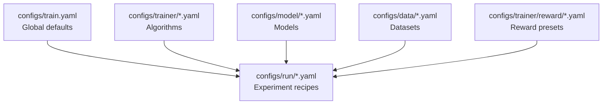

<Note>
**Scope:** This guide covers the Atlas training stack (Hydra configs, wrappers, optimization recipes). For the SDK runtime YAML, see the [`SDK Configuration Reference`](/sdk/configuration).
</Note>

## Directory Quick Reference

```text
configs/
├── wrappers/          🎯 START HERE – wrap your existing agent
├── examples/          ⚡ Ready-to-run tutorial configs
├── data/              💾 Dataset definitions
├── demo/              🔬 Full demo scenarios
├── rim_config.yaml    🏆 Reward system configuration
├── model/             🤖 Model architectures (advanced)
├── run/               🚀 Experiment recipes (SFT, GRPO, etc.)
└── trainer/           ⚙️ Algorithm defaults (GRPO, SFT)
```

<Info>
**Tip:** Start with `wrappers/` in the SDK to plug Atlas into your agent, then explore `data/`, `trainer/`, and `run/` here in Atlas Core for full GRPO training jobs. The deeper directories (`model/`, `trainer/`) are for advanced customisation.
</Info>

## Wrapping Your Agent (wrappers/)

<Tabs>
  <Tab title="HTTP API">
    ```yaml
    # configs/wrappers/my_api_agent.yaml
    user_agent:
      type: custom
      config:
        integration_type: http_api
        endpoint: "http://localhost:8000/chat"
        prompt_field: "message"
        response_field: "response"
        headers:
          Authorization: "Bearer YOUR_API_KEY"
        timeout: 300

    teacher_model: Arc-Intelligence/ATLAS-8B-Thinking
    trainset: arc-atlas-rl
    max_examples: 10
    compatibility_mode: true

    generation_config:
      max_tokens: 2048
      temperature: 0.7
      diagnostic_max_tokens: 500
    ```

    Use the SDK runtime CLI (`atlas sdk run ...`) or Python entry points (`atlas.core.run(...)`) to execute this wrapper. See the [`SDK Quickstart`](/sdk/quickstart) for end-to-end launch commands.
  </Tab>
  <Tab title="Python Function">
    ```yaml
    # configs/wrappers/my_python_agent.yaml
    user_agent:
      type: custom
      config:
        integration_type: python_function
        module_path: "/path/to/your/agent.py"
        function_name: "generate"

    teacher_model: Arc-Intelligence/ATLAS-8B-Thinking
    trainset: arc-atlas-rl
    max_examples: 10
    compatibility_mode: true

    generation_config:
      max_tokens: 2048
      temperature: 0.7
    ```

    ```python
    # agent.py
    def generate(prompt: str) -> str:
        """Your agent's generation function."""
        ...
    ```
  </Tab>
  <Tab title="CLI Command">
    ```yaml
    # configs/wrappers/my_cli_agent.yaml
    user_agent:
      type: custom
      config:
        integration_type: cli_command
        command: "python agent.py '{prompt}'"

    teacher_model: Arc-Intelligence/ATLAS-8B-Thinking
    trainset: arc-atlas-rl
    max_examples: 10
    compatibility_mode: true
    ```

    Run the wrapper through the SDK runtime (CLI or Python API) as described in the [`SDK Quickstart`](/sdk/quickstart).
  </Tab>
</Tabs>

## Optimization & Datasets

- `configs/data/` – Dataset definitions (`arc_atlas_rl.yaml`, `arc_atlas_sft.yaml`). Adjust `max_train_samples`, preprocessing, or add new splits.
- `configs/rim_config.yaml` – Reward system selections used by both runtime and training.

See [`Reward Design`](/concepts/reward-design) for guidance on judges, variance thresholds, and escalation strategies.

## Hydra Composition Deep Dive

Hydra composes experiment recipes from reusable building blocks.



### Layer Breakdown

| Layer | Purpose | Example Files | When to Modify |
|-------|---------|---------------|----------------|
| `train.yaml` | Global defaults | Single file | Rarely – system-wide changes only |
| `run/*.yaml` | Experiment recipes | `teacher_rcl.yaml`, `teacher_sft.yaml` | New experiment types |
| `model/*.yaml` | Model specifications | `qwen3_8b.yaml`, `llama3_8b.yaml` | Adding new architectures |
| `data/*.yaml` | Dataset configs | `arc_atlas_rl.yaml`, `arc_atlas_sft.yaml` | New datasets or preprocessing |
| `trainer/*.yaml` | Algorithm settings | `teacher_grpo.yaml`, `sft.yaml` | Tweaking GRPO/SFT defaults |
| `trainer/reward/*.yaml` | Reward presets (Hydra `_global_` group) | `rim_teaching.yaml` | Swap reward bundles or create new ensembles |

### Example: `configs/run/teacher_rcl.yaml`

<AccordionGroup>
  <Accordion title="Base structure">
    ```yaml
    defaults:
      - _self_
      - override /trainer: teacher_grpo
      - override /model: qwen3_8b
      - override /data: arc_atlas_rl
      - override /reward: rim_teaching
    ```
    Later overrides win conflicts. `_self_` keeps local settings at the top.
  </Accordion>
  <Accordion title="trainer: teacher_grpo">
    ```yaml
    beta: 0.04
    temperature: 0.7
    grpo_alpha: 0.5
    generation_aggregation_steps: 1
    ```
    Controls the GRPO algorithm; see the [`Trainers API`](/api-reference/trainers).
  </Accordion>
  <Accordion title="model: qwen3_8b">
    ```yaml
    model_name_or_path: Qwen/Qwen2.5-7B-Instruct
    torch_dtype: bfloat16
    attn_implementation: flash_attention_2
    model_kwargs:
      trust_remote_code: true
    ```
    Swap in new checkpoints or quantisation settings here.
  </Accordion>
  <Accordion title="data: arc_atlas_rl">
    ```yaml
    dataset_name: Arc-Intelligence/Arc-ATLAS
    dataset_config: rl
    max_train_samples: 100000
    preprocessing:
      max_length: 2048
      pad_to_multiple_of: 16
    ```
    Adjust dataset selection, sample limits, and preprocessing.
  </Accordion>
  <Accordion title="reward: rim_teaching">
    ```yaml
    teacher_reward:
      _target_: RIM.reward_adapter.RIMReward
      config_path: configs/rim_config.yaml
    ```
    Points the trainer at the reward ensemble defined in `rim_config.yaml`.
  </Accordion>
</AccordionGroup>

## Customisation Patterns

### Command-line Overrides

```bash
scripts/launch.sh 8 configs/run/teacher_sft.yaml learning_rate=1e-5
scripts/launch.sh 8 configs/run/teacher_sft.yaml model=llama3_8b
scripts/launch.sh 8 configs/run/teacher_sft.yaml \
  per_device_train_batch_size=2 \
  gradient_accumulation_steps=8
```

### Creating New Configurations

<Steps>
  <Step title="Pick the layer">
    New model → `configs/model/` • New dataset → `configs/data/` • New experiment → `configs/run/`.
  </Step>
  <Step title="Copy a template">
    ```bash
    cp configs/model/qwen3_8b.yaml configs/model/my_model.yaml
    ```
  </Step>
  <Step title="Edit the template">
    ```yaml
    model_name_or_path: meta-llama/Llama-3.2-8B-Instruct
    torch_dtype: float16
    load_in_4bit: true
    ```
  </Step>
  <Step title="Reference it in run config">
    ```yaml
    defaults:
      - override /model: my_model
    ```
  </Step>
</Steps>

### Multi-GPU Scaling

<Tabs>
  <Tab title="Single GPU">
    ```bash
    scripts/launch.sh 1 configs/run/teacher_sft.yaml \
      per_device_train_batch_size=1 \
      gradient_accumulation_steps=32 \
      offload=true
    ```
  </Tab>
  <Tab title="4 GPUs">
    ```bash
    scripts/launch.sh 4 configs/run/teacher_sft.yaml \
      per_device_train_batch_size=4 \
      gradient_accumulation_steps=4
    ```
  </Tab>
  <Tab title="8 GPUs">
    ```bash
    scripts/launch.sh 8 configs/run/teacher_sft.yaml \
      per_device_train_batch_size=8 \
      gradient_accumulation_steps=2
    ```
  </Tab>
</Tabs>

## Common Scenarios

### Memory-Constrained GPUs
```yaml
per_device_train_batch_size: 1
gradient_accumulation_steps: 16
gradient_checkpointing: true
offload: true
torch_dtype: float16
```

### Fast Iteration Mode
```yaml
max_train_samples: 1000
num_train_epochs: 1
save_steps: 100
eval_steps: 100
logging_steps: 10
```

### Production Training
```yaml
num_train_epochs: 3
learning_rate: 5e-6
warmup_ratio: 0.1
weight_decay: 0.01
eval_strategy: "steps"
eval_steps: 500
save_total_limit: 3
load_best_model_at_end: true
metric_for_best_model: "eval_reward"
```

## Debugging Config Issues

```bash
# Inspect composed configuration
python -m hydra.main \
  config_path=configs \
  config_name=train \
  hydra.verbose=true

# Override configs interactively
python -m hydra.main \
  config_path=configs \
  config_name=train \
  overrides="run=teacher_rcl model=my_model"
```

Use `hydra.verbose=true` to see each included file. If composition fails, confirm the path exists and the file is in the defaults list.

## Next Steps

<CardGroup cols="2">
  <Card title="Offline Training" icon="dumbbell" href="/training/offline/grpo-training">
    Full walkthrough for SFT and GRPO teacher training.
  </Card>
  <Card title="SDK Runtime" icon="bolt" href="/sdk/quickstart">
    Export traces and manage continual learning alongside Atlas Core.
  </Card>
  <Card title="Reward System" icon="trophy" href="/concepts/reward-design">
    Tune judges, thresholds, and escalation.
  </Card>
  <Card title="API Reference" icon="code" href="/api-reference/training-configs">
    Python APIs for loading and overriding configs programmatically.
  </Card>
</CardGroup>
