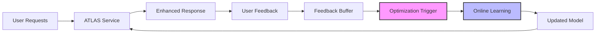

## Overview

Continuous learning enables ATLAS to improve automatically from production usage, creating a self-improving system that gets better with every interaction. This approach combines online optimization with production feedback loops.

## System Architecture



## Implementation

<Steps>
  <Step title="Set Up Feedback Collection">
    Implement feedback mechanisms in your production system:

    ```python
    from dataclasses import dataclass
    from typing import Optional
    import time

    @dataclass
    class FeedbackEvent:
        request_id: str
        prompt: str
        response: str
        user_rating: Optional[float] = None
        implicit_signal: Optional[str] = None
        timestamp: float = None
        metadata: dict = None

    class FeedbackCollector:
        """
        Collect and process production feedback
        """

        def __init__(self, buffer_size=1000):
            self.buffer = []
            self.buffer_size = buffer_size

        async def collect(self, event: FeedbackEvent):
            """
            Add feedback event to buffer
            """
            if not event.timestamp:
                event.timestamp = time.time()

            self.buffer.append(event)

            # Trigger optimization if buffer full
            if len(self.buffer) >= self.buffer_size:
                await self.trigger_optimization()

        def collect_implicit_feedback(self, request_id: str, signal: str):
            """
            Collect implicit signals (copy, share, retry, etc.)
            """
            event = FeedbackEvent(
                request_id=request_id,
                implicit_signal=signal,
                timestamp=time.time()
            )
            self.buffer.append(event)
    ```

    <Note>
    Implicit signals (copy events, time spent, retries) often provide more reliable feedback than explicit ratings.
    </Note>
  </Step>

  <Step title="Process Feedback Signals">
    Convert various feedback types into training signals:

    ```python
    class FeedbackProcessor:
        """
        Process feedback into training signals
        """

        def process_feedback(self, events):
            """
            Convert feedback events to training data
            """
            training_samples = []

            for event in events:
                score = self.compute_score(event)

                if score > self.quality_threshold:
                    training_samples.append({
                        'prompt': event.prompt,
                        'response': event.response,
                        'reward': score,
                        'metadata': event.metadata
                    })

            return training_samples

        def compute_score(self, event):
            """
            Unified scoring from multiple signals
            """
            score = 0.0

            # Explicit rating (if available)
            if event.user_rating:
                score += event.user_rating * 0.5

            # Implicit signals
            signal_scores = {
                'copy': 0.8,      # User copied response
                'share': 0.9,     # User shared response
                'retry': -0.3,    # User requested retry
                'dismiss': -0.5,  # User dismissed quickly
                'engage': 0.6     # Long engagement time
            }

            if event.implicit_signal:
                score += signal_scores.get(event.implicit_signal, 0) * 0.5

            return max(0, min(1, score))  # Normalize to [0, 1]
    ```

    <Warning>
    Filter low-quality feedback to prevent model degradation. Set appropriate quality thresholds.
    </Warning>
  </Step>

  <Step title="Implement Learning Triggers">
    Define when and how to trigger learning updates:

    ```python
    class LearningScheduler:
        """
        Schedule continuous learning updates
        """

        def __init__(self):
            self.triggers = {
                'sample_count': 100,      # Min samples
                'time_interval': 3600,    # Max seconds
                'performance_drop': 0.1,  # Trigger on degradation
                'error_threshold': 0.05   # Error rate trigger
            }
            self.last_update = time.time()
            self.baseline_performance = None

        def should_trigger(self, metrics, sample_count):
            """
            Determine if learning should trigger
            """
            # Sample count trigger
            if sample_count >= self.triggers['sample_count']:
                return True, 'sample_threshold'

            # Time-based trigger
            if time.time() - self.last_update > self.triggers['time_interval']:
                return True, 'time_interval'

            # Performance degradation trigger
            if self.baseline_performance:
                current = metrics.get('accuracy', 1.0)
                if self.baseline_performance - current > self.triggers['performance_drop']:
                    return True, 'performance_drop'

            # Error rate trigger
            if metrics.get('error_rate', 0) > self.triggers['error_threshold']:
                return True, 'high_errors'

            return False, None

        async def execute_update(self, training_samples):
            """
            Execute learning update
            """
            print(f"Triggering update with {len(training_samples)} samples")

            # Run online optimization
            optimizer = OnlineOptimizer()
            improved_model = await optimizer.optimize(
                training_samples,
                num_iterations=50
            )

            # Update timestamp
            self.last_update = time.time()

            return improved_model
    ```
  </Step>

  <Step title="Deploy Update Pipeline">
    Implement safe model updates in production:

    ```python
    class SafeModelUpdater:
        """
        Safely update models in production
        """

        def __init__(self, primary_model, validator):
            self.primary_model = primary_model
            self.validator = validator
            self.shadow_model = None
            self.update_history = []

        async def update(self, new_model):
            """
            Safe production update with validation
            """
            # Step 1: Validate new model
            validation_result = await self.validator.validate(new_model)

            if not validation_result.passed:
                print(f"Model failed validation: {validation_result.errors}")
                return False

            # Step 2: Shadow deployment
            self.shadow_model = new_model
            shadow_metrics = await self.shadow_test(duration=300)  # 5 min test

            # Step 3: Compare performance
            if shadow_metrics['performance'] < self.primary_model.performance * 0.95:
                print("Shadow model underperforming, rejecting update")
                return False

            # Step 4: Gradual rollout
            await self.gradual_rollout(new_model)

            # Step 5: Update primary
            self.primary_model = new_model
            self.update_history.append({
                'timestamp': time.time(),
                'performance': shadow_metrics['performance']
            })

            return True

        async def shadow_test(self, duration):
            """
            Test model in shadow mode
            """
            start_time = time.time()
            metrics = {'requests': 0, 'successes': 0}

            while time.time() - start_time < duration:
                # Process requests with both models
                request = await self.get_next_request()

                primary_response = self.primary_model.process(request)
                shadow_response = self.shadow_model.process(request)

                # Compare responses
                if self.responses_similar(primary_response, shadow_response):
                    metrics['successes'] += 1
                metrics['requests'] += 1

            metrics['performance'] = metrics['successes'] / max(1, metrics['requests'])
            return metrics

        async def gradual_rollout(self, new_model):
            """
            Gradually shift traffic to new model
            """
            rollout_stages = [0.1, 0.25, 0.5, 0.75, 1.0]

            for percentage in rollout_stages:
                self.traffic_split = percentage
                await asyncio.sleep(60)  # Monitor for 1 minute

                metrics = await self.collect_metrics()
                if metrics['error_rate'] > 0.05:
                    print(f"High error rate at {percentage*100}% rollout, rolling back")
                    self.traffic_split = 0
                    return False

            return True
    ```
  </Step>

  <Step title="Monitor Learning Progress">
    Track continuous learning effectiveness:

    ```python
    import wandb
    from datetime import datetime

    class LearningMonitor:
        """
        Monitor continuous learning progress
        """

        def __init__(self):
            wandb.init(project="atlas-continuous-learning")
            self.metrics_buffer = []

        def log_update(self, update_info):
            """
            Log learning update event
            """
            wandb.log({
                'update_timestamp': datetime.now().isoformat(),
                'samples_used': update_info['sample_count'],
                'trigger_reason': update_info['trigger'],
                'performance_before': update_info['performance_before'],
                'performance_after': update_info['performance_after'],
                'improvement': update_info['improvement'],
                'update_duration': update_info['duration']
            })

        def log_production_metrics(self, metrics):
            """
            Log ongoing production metrics
            """
            wandb.log({
                'accuracy': metrics['accuracy'],
                'latency_p50': metrics['latency_p50'],
                'latency_p99': metrics['latency_p99'],
                'error_rate': metrics['error_rate'],
                'feedback_score': metrics['avg_feedback'],
                'requests_per_second': metrics['rps']
            })

        def generate_report(self):
            """
            Generate learning effectiveness report
            """
            report = {
                'total_updates': len(self.update_history),
                'avg_improvement': np.mean([u['improvement'] for u in self.update_history]),
                'learning_velocity': self.compute_learning_velocity(),
                'stability_score': self.compute_stability()
            }

            return report
    ```
  </Step>
</Steps>

## Advanced Techniques

### Selective Learning

Learn from high-value interactions:

```python
class SelectiveLearner:
    """
    Selectively learn from high-value feedback
    """

    def __init__(self):
        self.value_estimator = self.load_value_model()
        self.learning_buffer = PriorityQueue()

    def estimate_learning_value(self, feedback_event):
        """
        Estimate value of learning from this event
        """
        features = {
            'uncertainty': self.compute_uncertainty(feedback_event.prompt),
            'novelty': self.compute_novelty(feedback_event.prompt),
            'error_magnitude': abs(feedback_event.expected - feedback_event.actual),
            'user_expertise': feedback_event.metadata.get('user_level', 0),
            'task_importance': feedback_event.metadata.get('priority', 0)
        }

        value_score = self.value_estimator.predict(features)
        return value_score

    def add_to_buffer(self, event):
        """
        Add high-value events to learning buffer
        """
        value = self.estimate_learning_value(event)

        if value > self.threshold:
            self.learning_buffer.put((-value, event))  # Negative for max-heap

    def get_learning_batch(self, batch_size=32):
        """
        Get highest-value samples for learning
        """
        batch = []
        for _ in range(min(batch_size, self.learning_buffer.qsize())):
            _, event = self.learning_buffer.get()
            batch.append(event)
        return batch
```

### Catastrophic Forgetting Prevention

Prevent degradation on previously learned tasks:

```python
class MemoryConsolidation:
    """
    Prevent catastrophic forgetting during continuous learning
    """

    def __init__(self, memory_size=1000):
        self.episodic_memory = []
        self.memory_size = memory_size
        self.task_boundaries = []

    def store_experiences(self, experiences, task_id):
        """
        Store representative experiences
        """
        # Select diverse, representative samples
        representative = self.select_representative(experiences)

        for exp in representative:
            if len(self.episodic_memory) >= self.memory_size:
                # Replace oldest or least important
                self.episodic_memory.pop(0)

            self.episodic_memory.append({
                'experience': exp,
                'task_id': task_id,
                'importance': self.compute_importance(exp)
            })

    def create_replay_batch(self, current_batch, replay_ratio=0.5):
        """
        Mix current and past experiences
        """
        replay_size = int(len(current_batch) * replay_ratio)

        # Sample from episodic memory
        if self.episodic_memory:
            replay_samples = random.sample(
                self.episodic_memory,
                min(replay_size, len(self.episodic_memory))
            )

            # Combine with current batch
            combined_batch = current_batch + [s['experience'] for s in replay_samples]
            random.shuffle(combined_batch)

            return combined_batch

        return current_batch

    def compute_importance(self, experience):
        """
        Compute importance for retention
        """
        # Factors: difficulty, uniqueness, performance impact
        return experience.get('learning_progress', 0.5)
```

### Active Learning

Actively seek informative feedback:

```python
class ActiveLearner:
    """
    Actively request feedback on uncertain cases
    """

    def __init__(self, uncertainty_model):
        self.uncertainty_model = uncertainty_model
        self.feedback_requests = []

    def should_request_feedback(self, prompt, response):
        """
        Decide whether to request feedback
        """
        uncertainty = self.uncertainty_model.compute_uncertainty(
            prompt,
            response
        )

        # Request feedback for uncertain cases
        if uncertainty > self.uncertainty_threshold:
            return True

        # Random sampling for baseline
        if random.random() < self.baseline_rate:
            return True

        return False

    def generate_feedback_request(self, prompt, response):
        """
        Create user-friendly feedback request
        """
        return {
            'message': "Help us improve! Was this response helpful?",
            'options': [
                {'label': 'Very helpful', 'value': 1.0},
                {'label': 'Somewhat helpful', 'value': 0.5},
                {'label': 'Not helpful', 'value': 0.0}
            ],
            'context': {
                'prompt': prompt,
                'response': response,
                'uncertainty': self.uncertainty_model.last_uncertainty
            }
        }
```

## Production Patterns

### Pattern 1: Blue-Green Deployment

```python
class BlueGreenDeployment:
    """
    Safe production updates with instant rollback
    """

    def __init__(self):
        self.blue_model = self.load_model('blue')
        self.green_model = None
        self.active = 'blue'

    async def deploy_update(self, new_model):
        """
        Deploy update to inactive environment
        """
        # Deploy to green
        self.green_model = new_model

        # Test green environment
        test_result = await self.test_green()

        if test_result.success:
            # Switch traffic
            self.active = 'green'
            print("Switched to green environment")
        else:
            # Keep blue active
            print("Green deployment failed, staying on blue")

        return test_result

    def rollback(self):
        """
        Instant rollback to previous version
        """
        self.active = 'blue' if self.active == 'green' else 'green'
        print(f"Rolled back to {self.active}")
```

### Pattern 2: Canary Deployment

```python
class CanaryDeployment:
    """
    Gradual rollout with monitoring
    """

    def __init__(self):
        self.stable_model = self.load_model('stable')
        self.canary_model = None
        self.canary_percentage = 0

    async def deploy_canary(self, new_model):
        """
        Gradually increase traffic to new model
        """
        self.canary_model = new_model

        stages = [1, 5, 10, 25, 50, 100]  # Percentage stages

        for percentage in stages:
            self.canary_percentage = percentage
            print(f"Canary at {percentage}%")

            # Monitor for 5 minutes
            await asyncio.sleep(300)

            metrics = await self.collect_metrics()

            if not self.health_check(metrics):
                print(f"Canary failed at {percentage}%")
                self.canary_percentage = 0
                return False

        # Full deployment successful
        self.stable_model = self.canary_model
        self.canary_model = None
        return True
```

## Monitoring Dashboard

Create a comprehensive monitoring dashboard:

```python
def create_dashboard():
    """
    Create Streamlit dashboard for continuous learning
    """
    import streamlit as st
    import plotly.graph_objs as go

    st.title("ATLAS Continuous Learning Dashboard")

    # Learning progress
    col1, col2, col3 = st.columns(3)

    with col1:
        st.metric(
            "Total Updates",
            metrics['total_updates'],
            delta=metrics['updates_today']
        )

    with col2:
        st.metric(
            "Avg Improvement",
            f"{metrics['avg_improvement']:.1%}",
            delta=f"{metrics['recent_improvement']:.1%}"
        )

    with col3:
        st.metric(
            "Learning Velocity",
            f"{metrics['velocity']:.2f}",
            delta=f"{metrics['velocity_change']:.2f}"
        )

    # Performance over time
    fig = go.Figure()
    fig.add_trace(go.Scatter(
        x=metrics['timestamps'],
        y=metrics['performance'],
        mode='lines+markers',
        name='Performance'
    ))
    fig.add_trace(go.Scatter(
        x=metrics['update_times'],
        y=metrics['update_performance'],
        mode='markers',
        marker=dict(size=10, color='red'),
        name='Updates'
    ))
    st.plotly_chart(fig)

    # Feedback distribution
    st.subheader("Feedback Distribution")
    feedback_chart = go.Figure(data=[
        go.Bar(
            x=['Positive', 'Neutral', 'Negative'],
            y=metrics['feedback_distribution']
        )
    ])
    st.plotly_chart(feedback_chart)

    # Recent learning events
    st.subheader("Recent Learning Events")
    st.dataframe(metrics['recent_events'])
```

## Troubleshooting

<AccordionGroup>
  <Accordion title="Model Performance Degradation">
    **Problem**: Performance drops after update

    **Solutions**:
    - Increase validation threshold
    - Implement stricter shadow testing
    - Increase replay ratio for memory consolidation
    - Review feedback quality filters
  </Accordion>

  <Accordion title="Slow Learning Convergence">
    **Problem**: Improvements are minimal

    **Solutions**:
    - Increase learning rate carefully
    - Focus on high-value feedback
    - Improve feedback signal quality
    - Consider offline retraining
  </Accordion>

  <Accordion title="High Update Frequency">
    **Problem**: Too many updates affecting stability

    **Solutions**:
    - Increase sample count threshold
    - Implement update rate limiting
    - Batch updates into larger intervals
    - Add stability metrics to triggers
  </Accordion>
</AccordionGroup>

## Next Steps

<CardGroup cols={2}>
  <Card title="Production Deployment" icon="rocket" href="/integration/production-deployment">
    Deploy continuous learning systems
  </Card>
  <Card title="Monitoring Setup" icon="chart-line" href="/integration/production-deployment#monitoring-and-observability">
    Configure comprehensive monitoring
  </Card>
  <Card title="Offline Training" icon="dumbbell" href="/training/offline/grpo-training">
    Train foundation models
  </Card>
  <Card title="Production Deployment" icon="server" href="/integration/production-deployment">
    Deploy to production
  </Card>
</CardGroup>